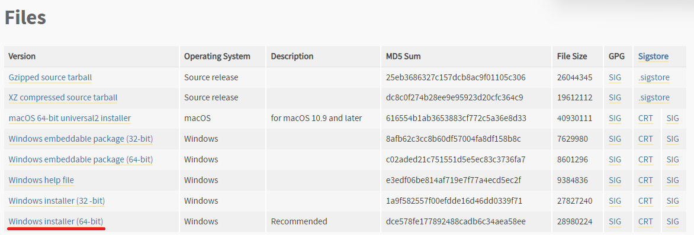
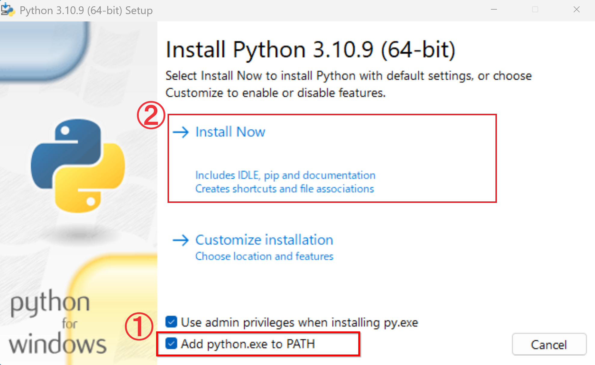
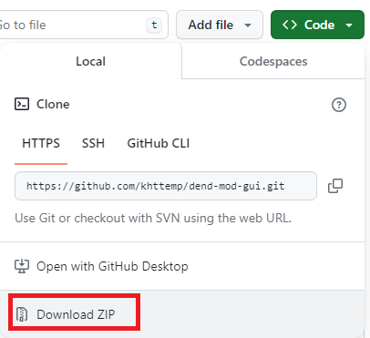

## Windows 版実行バイナリ（ .exeファイル ）の作成方法

セキュリティソフトによって、実行できない環境で実行ファイルの作成方法


### インストール

まず、python3をインストールする。

3.10.9をインストールする。[【インストールリンク】](https://www.python.org/downloads/release/python-3109/)




Windows環境なら、「Windows installer (64-bit)」をクリックしてダウンロードする




ダウンロードしたファイルを起動する、

この画面が出たら、必ず①（Add python.exe to PATH）をチェックした状態で

②（インストール）をクリックする


### ソースダウンロード

インストールが出来たら、ソースをダウンロードしよう



Download Zipをクリックする

ダウンロードしたzipファイルを解凍する

### FBX Python SDKをインストール

https://aps.autodesk.com/developer/overview/fbx-sdk

上記のサイトで、FBX Python SDKをダウンロードしてインストールする。

インストール出来たら、下記のようにバッチを実行する

```
pip install "C:\Program Files\Autodesk\FBX\FBX Python SDK\2020.3.7\fbx-2020.3.7-cp310-none-win_amd64.whl"
```

### バッチファイルの実行

1. まず、setup.batのバッチファイルを実行する

2. 次に、makeExe.batのバッチファイルを実行する

3. distのフォルダーにmain.exeが作成される


## 不具合情報

### ImportError: DLL load failed while importing fbxが出る

「Visual Studio 2015 の Visual C++ 再頒布可能パッケージ」がインストールされてない可能性が高い。

下記のサイトでダウンロードしてインストールした後、再作成してみること。

https://www.microsoft.com/ja-jp/download/details.aspx?id=48145


## 動作確認をした、pipの環境リスト

| 名称 | バージョン |
| --- | --- |
| altgraph | 0.17.4 |
| Brotli | 1.1.0 |
| certifi | 2025.8.3 |
| charset-normalizer | 3.4.3 |
| et_xmlfile | 2.0.0 |
| etcpak | 0.9.8 |
| fbx | C:/Program Files/Autodesk/FBX/FBX Python SDK/2020.3.7/fbx-2020.3.7-cp310-none-win_amd64.whl |
| idna | 3.10 |
| lz4 | 4.4.4 |
| openpyxl | 3.1.5 |
| packaging | 25.0 |
| pefile | 2024.8.26 |
| pillow | 11.3.0 |
| pyfmodex | 0.7.2 |
| pyinstaller | 6.10.0 |
| pyinstaller-hooks-contrib | 2025.8 |
| Pymem | 1.14.0 |
| pywin32-ctypes | 0.2.3 |
| requests | 2.32.5 |
| tabulate | 0.9.0 |
| texture2ddecoder | 1.0.5 |
| UnityPy | 1.9.28 |
| urllib3 | 2.5.0 |