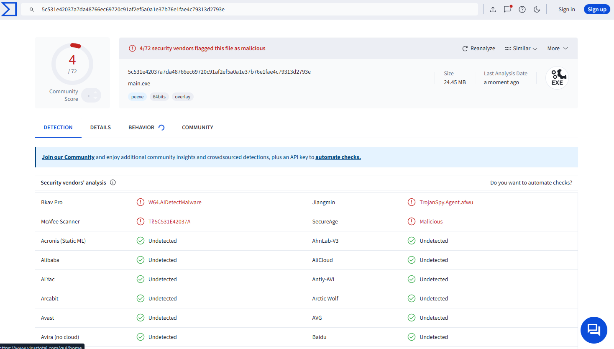

# dend-mod-gui

## 概要

dend-mod-guiは、電車でDのデータ改造のため、GUI画面上で編集するソフトウェアである。

## 動作環境

* 電車でDが動くコンピュータであること
* OS: Windows 10 64bit の最新のアップデートであること
* OSの端末が日本語に対応していること

※ MacOS 、 Linux などの Unix 系 OS での動作は保証できない。

## 免責事項

このプログラムを使用して発生したいかなる損害も製作者は責任を負わない。

このプログラムを実行する前に、自身のコンピュータのフルバックアップを取得して、
安全を担保したうえで実行すること。
このプログラムについて、電車でD 作者である、地主一派へ問い合わせてはいけない。

このソフトウェアの更新やバグ取りは、作者の義務ではなく解消努力目標とする。
Issue に上げられたバグ情報が必ず修正されるものではない。

* ライセンス：MIT

電車でD の正式なライセンスを持っていること。

本プログラムに関連して訴訟の必要が生じた場合、東京地方裁判所を第一審の専属的合意管轄裁判所とする。

このプログラムのバイナリを実行した時点で、この規約に同意したものと見なす。

## 実行方法


メニュの「改造プログラム」で改造したいプログラム種類を選ぶ。

メニュの「ファイル」→「ファイルを開く」で指定のBINファイルを開く。

必ず、プログラムが書込みできる場所で行ってください。


### SS改造

実行方法は、[【こちら】](/program/ssUnity/README.md)のリンクを参照

### 車両改造

実行方法は、[【こちら】](/program/orgInfoEditor/README.md)のリンクを参照

### モデルバイナリ

実行方法は、[【こちら】](/program/mdlBin/README.md)のリンクを参照

### MDLINFO

実行方法は、[【こちら】](/program/mdlinfo/README.md)のリンクを参照

### コミックスクリプト

実行方法は、[【こちら】](/program/comicscript/README.md)のリンクを参照

### BGMリスト

実行方法は、[【こちら】](/program/musicEditor/README.md)のリンクを参照

### FVT作成

実行方法は、[【こちら】](/program/fvtMaker/README.md)のリンクを参照

### レールエディター

実行方法は、[【こちら】](/program/railEditor/README.md)のリンクを参照

### RSのレール・AMB

実行方法は、[【こちら】](/program/rsRail/README.md)のリンクを参照

### SMF

実行方法は、[【こちら】](/program/smf/README.md)のリンクを参照

## ソースコード版の実行方法

### GUIバージョン

このソフトウェアは Python3 系で開発されているため、 Python3 系がインストールされた開発機であれば、
ソースコードからソフトウェアの実行が可能である。

### CUIバージョン

旧作のレールデータ、SSのステージデータに限って、コマンドで上書きすることができる。

/saveRail : エクセルファイルで、レールデータ・ステージデータを上書きする

/quietSaveRail : 成功のメッセージボックスを表示せずに、/saveRailを実行する

/debugSaveRail : プログラムが判断した、エクセルと、ファイルのフルパスを表示する

旧作の場合

```
main /saveRail [レールデータのエクセルファイル] [レールデータのbinファイル]
```

```
例） main /saveRail RAIL300.xlsx RAIL300.bin
例） main /quietSaveRail RAIL300.xlsx RAIL300.bin
例） main /debugSaveRail RAIL300.xlsx RAIL300.bin
```

SSの場合

```
main /saveRail [ステージデータのエクセルファイル] [ステージデータのdenファイル]
main /quietSaveRail [ステージデータのエクセルファイル] [ステージデータのdenファイル]
```

または

```
main /saveRail [ステージデータのテキストファイル] [ステージデータのdenファイル]
main /quietSaveRail [ステージデータのテキストファイル] [ステージデータのdenファイル]
```

```
例） main /quietSaveRail stagedata.xlsx tq5050.den
例） main /saveRail stagedata.txt tq5050.den 
```

### 依存ライブラリ

* Tkinter

  Windows 版 Python3 系であれば、インストール時のオプション画面で tcl/tk and IDLE のチェックがあったと思う。
  tcl/tk and IDLE にチェックが入っていればインストールされる。
  
  Linux 系 OS では、 パッケージ管理システムを使用してインストールする。

* requests

  最新バージョン確認時に使うライブラリ

* UnityPy

  「SS改造」で使うライブラリ

* openpyxl

  エクセルでデータを取り出す時に使うライブラリ

* pymem

  「RSのレール・AMB」で使うライブラリ

### 動作環境

以下の環境で、ソースコード版の動作確認を行った

* OS: Windows 10 64bit
* Python 3.10.9 64bit
* pip 22.3.1 64bit
* PyInstaller 5.9.0 64bit
* 横1024×縦768ピクセル以上の画面解像度があるコンピュータ


## ソースコードの直接実行

Windows であれば以下のコマンドを入力する。


````
> python main.py
````

これで、実行方法に記載した画面が現れれば動作している。

### FAQ

* Q. ImportError: No module named tkinter と言われて起動しない

  * A. 下のようなメッセージだろうか？ それであれば、 tkinter がインストールされていないので、インストールすること。
  
  ````
  > python main.py
  Traceback (most recent call last):
    File "main.py", line 5, in <module>
      import tkinter
  ImportError: No module named tkinter
  ````

### Windows 版実行バイナリ（ .exeファイル ）の作成方法

[【こちら】](MAKE.md)のリンクを参照

### Virustotal



以上。