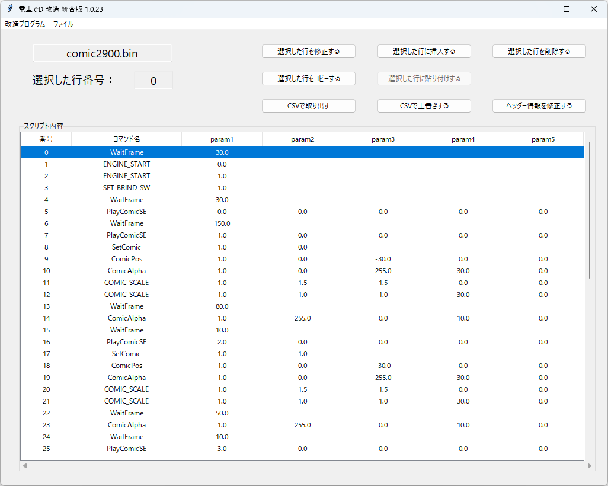
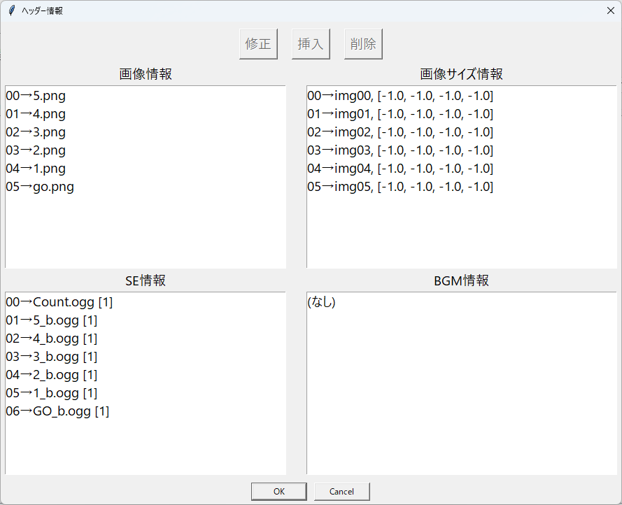

# コミックスクリプト

## コミックスクリプトの仕組み

スクリプトの仕組みについては、[【こちら】](/program/comicscript/script.md)のリンクを参照

## コマンドリスト

コマンドリストについては、[【こちら】](https://khttemp.github.io/dendData/comicscript/cmdList.html)のリンクを参照

## 実行方法

1. メニュの「ファイルの開く」で「COMIC*.BIN」を開く。

    必ず、プログラムが書込みできる場所で行ってください

2. 編集したい行を選ぶ

3. 「選択した行を修正する」ボタンで、コマンドやパラメータを修正する

4. 「選択した行に挿入する」ボタンで、新しいコマンドを挿入する

5. 「選択した行を削除する」ボタンで、指定した行を削除する

6. 「選択した行をコピーする」ボタンで、指定した行をコピーできる

    ボタンを押下すると、「選択した行に貼り付けする」ボタンが活性化される

7. 「選択した行に貼り付けする」ボタンで、一番最近にコピーした行を挿入できる

8. 修正が行われたとき、すぐ保存される

9. 「CSVで取り出す」ボタンで、現在コミックスクリプトをCSVで取り出すことができる

10. 「CSVで上書きする」ボタンで、現在コミックスクリプトを作成したCSVで上書きすることができる

## ヘッダー情報の修正方法

「ヘッダー情報を修正する」ボタンで、現在コミックスクリプトのヘッダー情報を修正できる

それぞれ、画像のファイル、画像ファイルのサイズ調整、

SE情報、BGM情報を修正できる。

ただし、SE情報のグループ取得や、BGM情報のループ設定などの

詳細な設定は、SSでは適用されない。

## 実行できるスクリプトの判定

オプションでゲームを選択した状態で、スクリプトを読込むと

実行できないスクリプトは、赤文字で表示される

### FAQ

* Q. 電車でD ゲームがあるのに、 COMIC*.BIN が無い。 
  
  * A. Rising Stageまでの旧作は、Packファイルを

    GARbro のような、アーカイバで展開すると得られる。

  * A. GARbro を使用して空パスワードで解凍すると無効なファイルになるので、適切なパスワードを入力すること。

* Q. BINファイルを指定しても、「電車でDのコミックスクリプトではない、またはファイルが壊れた可能性があります。」と言われる

  * A. 抽出方法が間違っているか、抽出時のパスワードが間違っているのでは？作業工程をやり直した方がよい。

* Q. BINファイルを改造しても、変化がないけど？

  * A. Rising Stageまでの旧作は、既存のPackファイルとフォルダーが同時にあるなら、

    Packファイルを優先して読み込んでいる可能性がある。

    読み込みしないように、抽出したPackファイルを変更するか消そう。

    Shining Stageの場合は、InGameDataの "一番最新" の「ver*」フォルダーを優先して読み込んでいる可能性がある。

* Q. ダウンロードがブロックされる、実行がブロックされる、セキュリティソフトに削除される

  * A. ソフトウェア署名などを行っていないので、ブラウザによってはダウンロードがブロックされる
  * A. 同様の理由でセキュリティソフトが実行を拒否することもある。

以上。