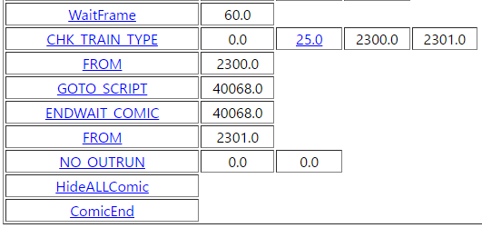

# コミックスクリプトの仕組み

※SSのコミックスクリプトCOMIC40068.binから抜粋

基本的に、コミックスクリプトは

実行させるコマンド、パラメータで大きく２つで構成されている

ここでは、簡単な例で説明する

もっと詳しいコマンド解説については、[【こちら】](https://khttemp.github.io/dendData/comicscript/cmdList.html)のリンクを参照

## 1. WaitFrame

スクリプト実行は、基本的に数フレーム単位で終わる。

### WaitFrameの、パラメータ１

このコマンドは、スクリプト実行を、パラメータ１に書かれている分だけ待つ。

パラメータ１が「60.0」なので、60フレーム待つ。

## 2. CHK_TRAIN_TYPE

現在の車両の種別を判断する。

### CHK_TRAIN_TYPEの、パラメータ１

パラメータ１が、「0.0」なので、1Pの車両が対象になる

もし「1.0」の場合は、2Pの車両が対象になる。

ストーリーモードでは、2P = CPUの車両扱いになる。

試運転モードでは、不正な値となるので注意すること。

### CHK_TRAIN_TYPEの、パラメータ２

パラメータ２が、「25.0」なので、

これは内部コードで定義されている「H2300」のことである。

つまり、上記と合わせると、

1Pの車両が、阪急2300系か？という条件文判断のコマンドとなる

### CHK_TRAIN_TYPEの、パラメータ３、４

上記の条件文判断結果に従って

後に説明する、FROMのコマンドへ飛ぶ。

飛ぶ場合、現在のコマンドから初めて

FROMコマンドとパラメータが一致する、一番最初の行で止まる。

FROMコマンドを定義してなかった場合、エラーになる場合がある。

 

パラメータ３が「2300.0」、パラメータ４が「2301.0」なので、

上記の条件文がTrueの場合、パラメータ３に従い、

条件文がFalseの場合、パラメータ４へ飛ぶ。

## 3. FROM

CHK_TRAIN_TYPEなど、条件に従って【飛ぶ】のコマンドに

対応するための、Labelコマンド

ラベル以外、特別な動作は何もないので、すぐ下のコマンドへ行く

## 4. GOTO_SCRIPT

コミックスクリプトを並列で起動する場合に使うコマンド

### GOTO_SCRIPTのパラメータ１

この場合、パラメータ１が「40068.0」なので、

COMIC40068.BINを並列で起動しておき、

すぐ下のコマンドへ行く

## 5. ENDWAIT_COMIC

起動しているスクリプトが終わるまでずっと待つコマンド

主に、GOTO_SCRIPTと一緒に使う場合が多い

### ENDWAIT_COMICのパラメータ１

この場合、パラメータ１が「40068.0」なので、

COMIC40068.BINが終わるまで、ずっと待つ

## 7. NO_OUTRUN

車両を脱線させないようにするコマンド

### NO_OUTRUNのパラメータ１

パラメータ１が、「0.0」なので、1Pの車両が対象になる

### NO_OUTRUNのパラメータ２

パラメータ２が、「0.0」なので、脱線させないフラグをFalseにする。

つまり、車両は脱線できるデフォルト状態となる。

もし、パラメータが「1.0」で設定されていれば

脱線させないフラグをTrueに設定するので、

どんな状況でも脱線させないようにする。

脱線させないフラグは、主にカメライベントなど視点が変わってしまって

ちゃんとコーナー対応できない場合などで使われる。

## 8. HideALLComic

全てのコミックを消すコマンド

## 9. ComicEnd

コミックスクリプトを終了する。

全てのコミックスクリプトで、最後のコマンドは必ず、これをつけるべき。