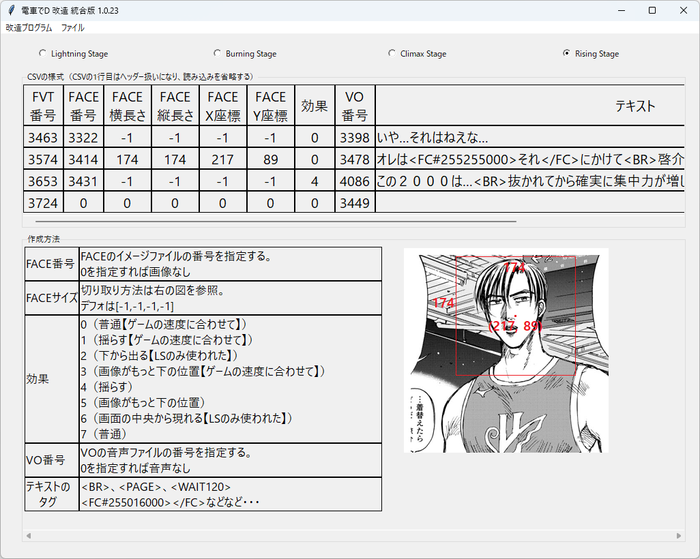

# FVT作成

## 実行方法

1. ラジオボタンで、ゲームを選ぶ。

    そうするとCSVの様式の例を見れる。

    テキストは、shift-jisで変換できる文字にすること。

2. メニュの「ファイルの開く」でCSVファイルを開く。

3. OKボタンをクリックすると、読み込んだCSVを元にFVTファイルを作成する。

### FAQ

* Q. ダウンロードがブロックされる、実行がブロックされる、セキュリティソフトに削除される

  * A. ソフトウェア署名などを行っていないので、ブラウザによってはダウンロードがブロックされる
  * A. 同様の理由でセキュリティソフトが実行を拒否することもある。

以上。