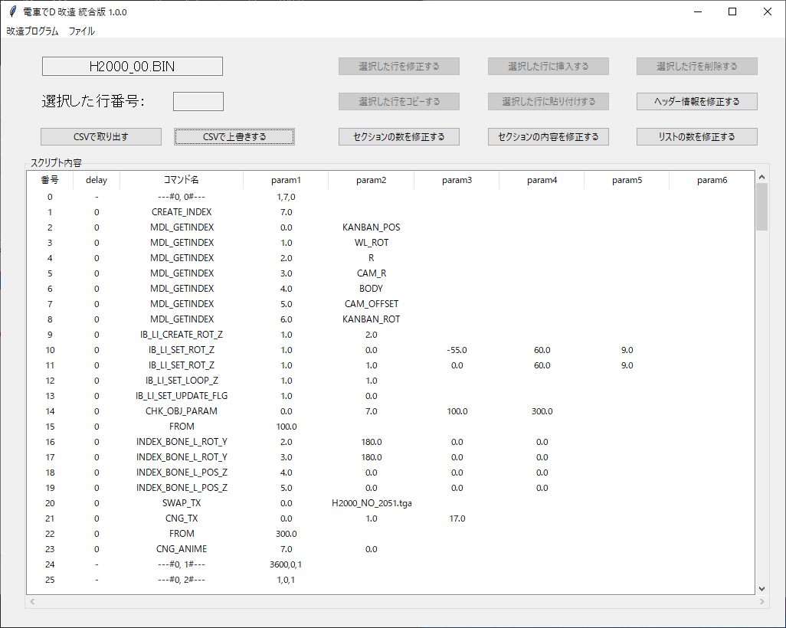
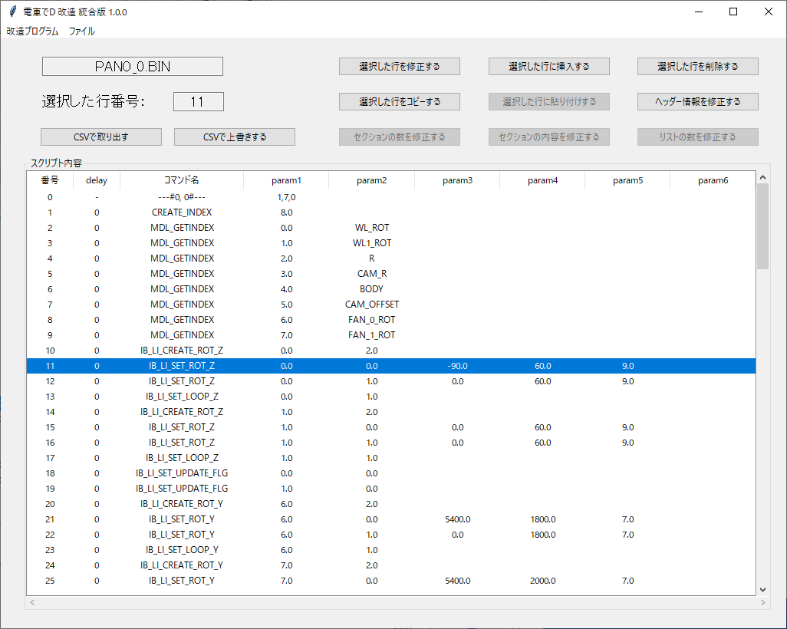
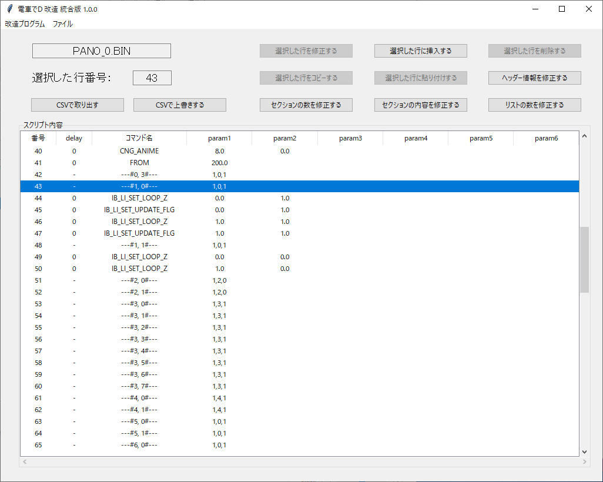
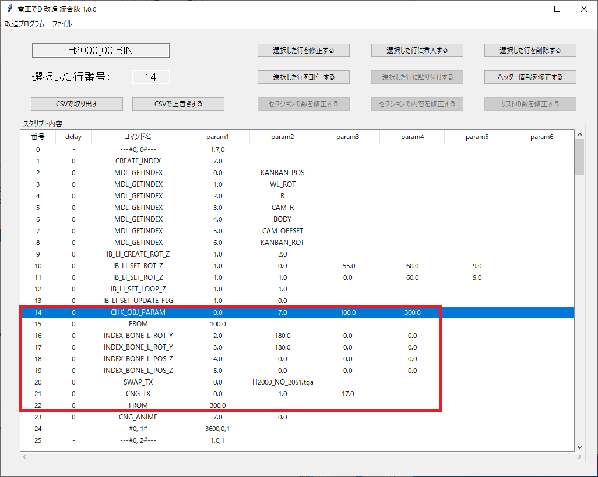
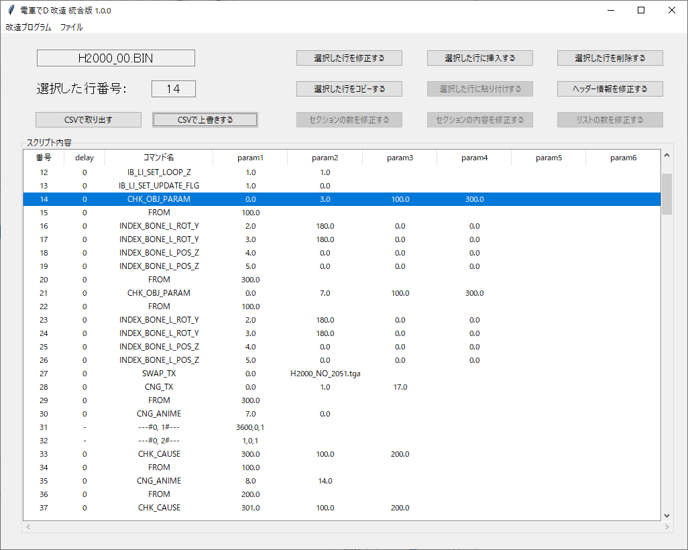
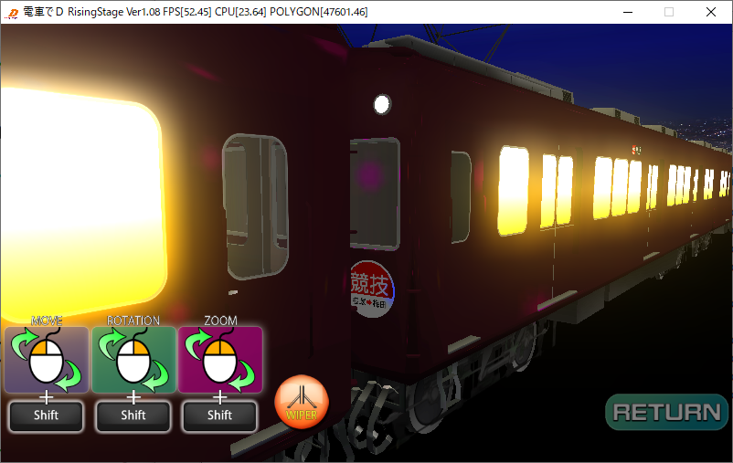
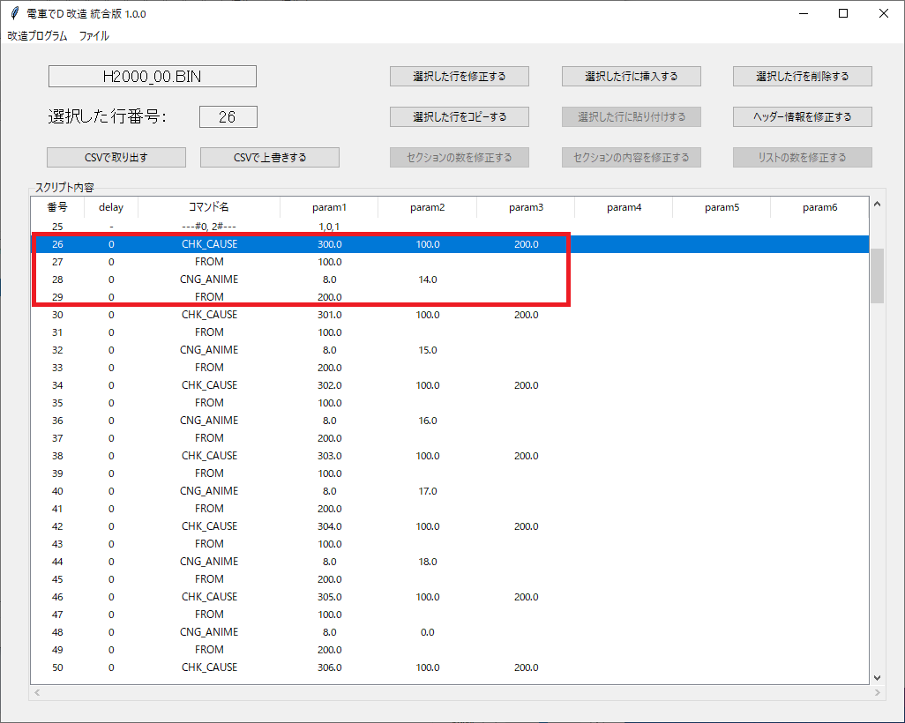
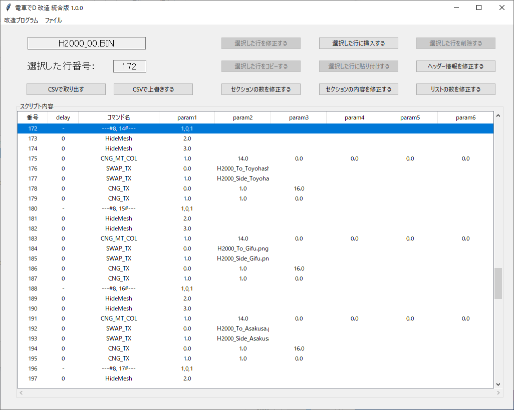

# モデルバイナリ

車両以外に関するバイナリの説明は[【こちら】](/program/mdlBin/mdlBin.md)のリンクを参照

## 実行方法

1. メニュの「ファイルの開く」で指定のBINファイルを開く。

    そのバイナリファイルは、【モデル名_番号.BIN】の形式である。

    例）H2000_00.BIN、H2800_00.BIN、MU2000_0.BIN・・・

    必ず、プログラムが書込みできる場所で行ってください

2. スクリプト内容の行を選ぶ

    このバイナリファイルの構成は全部10個のリストがあり

    このリストの中から、さらに分けられている。

    区切りの形式は【---#9, 9#---】とした。（以下、9-9とする）

3. 区切りの行を選択すると、「セクションの数を修正する」と「セクションの内容を修正する」と

    「リストの数を修正する」ボタンが活性化する。

    「セクションの数を修正する」ボタンで、現在の区切りを基準にリストの数を修正できる。

    「リストの数を修正する」ボタンで、区切り自体を増やしたり、減らすことも出来る。

4. コマンドの行を選択すると、このコマンドを修正、挿入、削除、コピーできる。

    コピーしたコマンドは区切りの中で挿入できる。

5. 「ヘッダー情報を修正する」ボタンで、ヘッダーに含まれている画像などの情報を修正できる

6. このプログラムは、コマンドや区切りに修正を加えた瞬間、すぐ保存される。

### FAQ

* Q. 電車でDのゲームがあるが、指定したBINファイルがない。  

  * A. PackファイルをGARbro のような、アーカイバで展開すると得られる。

  * A. GARbro を使用して空パスワードで解凍すると無効なファイルになるので、適切なパスワードを入力すること。

* Q. BINファイルを指定しても、「電車でDのファイルではない、またはファイルが壊れた可能性があります。」と言われる

  * A. 抽出方法が間違っているか、抽出時のパスワードが間違っているのでは？作業工程をやり直した方がよい。

* Q. BINファイルを改造しても、変化がないけど？

  * A. 既存のPackファイルとフォルダーが同時にあるなら、Packファイルを優先して読み込んでいる可能性がある。

    読み込みしないように、抽出したPackファイルを変更するか消そう。

* Q. ダウンロードがブロックされる、実行がブロックされる、セキュリティソフトに削除される

  * A. ソフトウェア署名などを行っていないので、ブラウザによってはダウンロードがブロックされる

  * A. 同様の理由でセキュリティソフトが実行を拒否することもある。

## モデルの枠の機能（推定）

| 枠 | 機能（推定） |
| --- | --- |
| 0-0 | 初期処理 |
| 0-1 | 詳細不明（コンプレッサー数値？） |
| 0-2 | コースによる幕のANIME設定 |
| 0-3 | 詳細不明 |
| 1-0 | START_WIPER処理 |
| 1-1 | STOP_WIPER処理 |
| 2-0 ～ 2-2 | JR2000のSMOKE生成処理 |
| 3-0 ～ 3-8 | JR2000のSMOKE動き処理 |
| 4-0 ～ 4-1 | JR2000のSMOKE_B生成・動き処理 |
| 5-0 ～ 5-1 | JR2000のガスタービン生成処理（1Pと2P） |
| 6-0 ～ 6-1 | JR2000のガスタービン生成処理（1Pと2P） |
| 7-0 | 初期方向のライト処理（推進運転含む） |
| 7-1 | 折り返し方向のライト処理（推進運転含む） |
| 8-0 ～ 8-18 | 幕のファイル入れ方参照 |
| 9-0 | スイッチバック時の車番処理 |
| 9-1 | 初期方向の車番処理 |
| 9-2 | ブラインドアタック時の車内灯設定 |
| 9-3 | ブラインドアタック解除時の車内灯設定 |
| 9-4 | 回送コマンド(SET_KAISO)設定時の処理 |
| 9-5 | 回送コマンド(SET_KAISO)解除時の処理 |
| 9-6 | SET_FORでライトを消す時の幕・ライトの灯設定 |
| 9-7 | SET_FORでライトを付ける時の幕・ライトの灯設定 |

## モデルバイナリの改造方法

### ワイパーの動きを修正する

ワイパーの動きを決めるのは0-0、1-0、1-1の枠である。

MDL_GETINDEXの内容が「WL」が左のワイパーのモデルである

IB_LI_CREATE_ROT_Zでアニメのindexを作り

IB_LI_SET_ROT_Zで、モデルindex、アニメindex、曲げる角度、アニメフレーム、動き方を決める

IB_LI_SET_UPDATE_FLG、IB_LI_SET_LOOP_Zの初期値0で

アニメindexのループを止める。

1-0はコミックスクリプトでワイパーを動かすときの動作を定義している。

IB_LI_SET_UPDATE_FLG、IB_LI_SET_LOOP_Zを1に設定して動かす。

1-1はコミックスクリプトでワイパーを止めるときの動作を定義している。

IB_LI_SET_LOOP_Zを0に設定して止める。

### モデルを180度回転する

モデルの回転は0-0の枠でやっている。

CHK_OBJ_PARAMで、インデックスが7の場合（8両目）の場合

FROM 100に移動し、コマンドで180度回転している。

インデックスが7ではない場合、FROM 300に移動する。

これを応用し、下記の図が阪急2000系の4両目と8両目を180度回転したバイナリである。

※必ず、Climax Stageの場合は「TRAIN_DATA3RD.BIN」

  　Rising Stageの場合は「TRAIN_DATA4TH.BIN」の

  　モデルインデックスの並びも修正すること。

適用した画像

### 編成を増やす、減らす

0-0、7-0、7-1、9-0、9-1の枠などに定義されている

CHK_OBJ_PARAMを調整する必要がある

特に、編成を減らしたときには、存在しないindexを指定すると、ゲームが落ちる

### 幕の設定方法

幕の設定は0-2の枠でやっている。

CHK_CAUSEのコマンドで、選択したコース名を比較し

一致すれば2番目のFROMの行、違う場合、3番目のFROMの行まで移動する

そして、CHG_ANIMEで、指定している枠で幕を設定する

例）300（名鉄名古屋本線）の場合、8-14で設定した幕に変える

コースのリストと数字の関係

| 数字 | マップ名 |
| --- | --- |
| 200 | 神戸電鉄 有馬・三田線 |
| 201 | 阪急神戸線 |
| 202 | 京急本線 |
| 203 | 近鉄奈良線 |
| 204 | 南海空港線 |
| 299 | Climax StageのOP |
| 300 | 名鉄名古屋本線 |
| 301 | 名鉄空港線、常滑線 |
| 302 | 東武伊勢崎・日光線（ダウンヒル） |
| 303 | 東武伊勢崎・日光線（ヒルクライム） |
| 304 | 東武東上線 |
| 399 | Rising StageのOP |

### 幕のファイル入れ方

幕のファイルは、リスト8の中で保存する

さっきの、名鉄名古屋本線の8-14の場合、

SWAP_TXで、幕のファイル（H2000_To_Toyohashi.png、H2000_Side_Toyohashi.png）を指定している。

この画像ファイルは、PackのMDLフォルダー入れる必要がある。

リストに何もない場合、どのファイルを入れてもいいが

下記のような規則で並んでいると思われる。

| リスト | 幕 |
| --- | --- |
| 8-0 | デフォルト幕（宝塚→梅田が多い） |
| 8-1 | 京津三条→浜大津 |
| 8-2 | 使われてない（推定：阪急京都線） |
| 8-3 | 使われてない（推定：京阪本線） |
| 8-4 | 使われてない（推定：近鉄大阪線ヒルクライム） |
| 8-5 | 使われてない（推定：近鉄大阪線ダウンヒル） |
| 8-6 | 回送 |
| 8-7 | 使われてない（推定：阪急神戸線） |
| 8-8 | 新開地→三田 |
| 8-9 | 三田→新開地 |
| 8-10 | 京急久里浜→品川 |
| 8-11 | 近鉄奈良→難波 |
| 8-12 | 黒色の幕 |
| 8-13 | 三宮→梅田 |
| 8-14 | 岐阜→豊橋 |
| 8-15 | 中部国際空港→岐阜 |
| 8-16 | 鬼怒川温泉→浅草 |
| 8-17 | 浅草→東武日光 |
| 8-18 | 池袋⇔嵐山信号場 |

### 回送幕

推測であるが、コマンドスクリプトのSET_KAISOでする場合

9-4の枠でやっている可能性が高い

ただ、モデルによって回送幕の変え方が違ったりすることもあるので注意が必要。

以上。