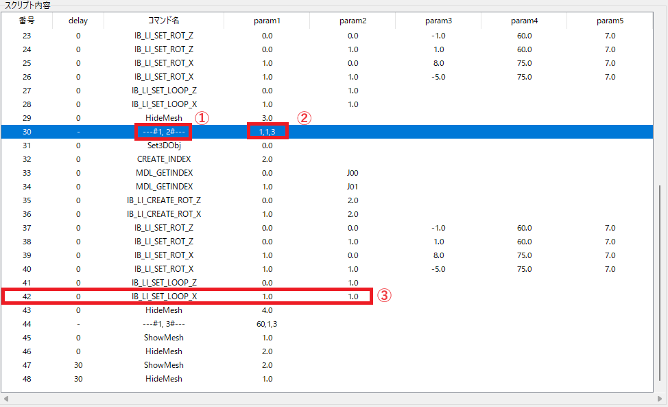
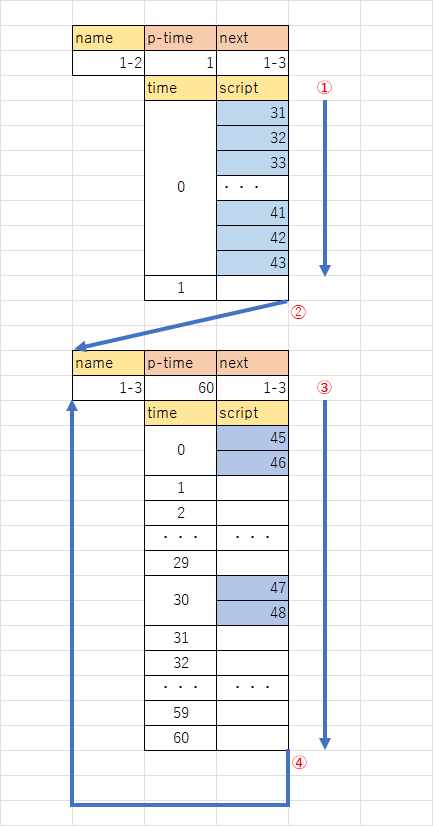

# モデルバイナリ(車両以外)

## バイナリの機能（推定）

### ① バイナリ実行枠

現在実行しているバイナリの枠のインデックス

### ② 時間・次の実行バイナリ枠

パラメータの時間内に実行し、次のバイナリ枠を実行する。

基本的に、モデルバイナリは無限ループで実行することを前提に作成される。

### ③ スクリプト

delayの時間に、指定のスクリプトを実行する。

## 例）1-2の枠の実行手順

1. 時間は「1」、次の実行バイナリ枠は「1-3」である。

2. 時間が0のとき（すぐに実行）スクリプト31番~43番まで順番に実行する。

   ただし、もしdelayの時間がパラメータの時間より大きい場合、

   その行以降は無視され、次のバイナリ枠へ行く。

3. 次のバイナリ枠「1-3」へ移動

4. 「1-3」の時間は「60」、次の実行バイナリ枠は「1-3」である。

5. 時間が0のとき（すぐに実行）スクリプト45番～46番を順番に実行する。

6. 30フレーム待ち、スクリプト47番～48番を順番に実行する。

7. 次のバイナリ枠「1-3」へ移動（以後繰り返し）