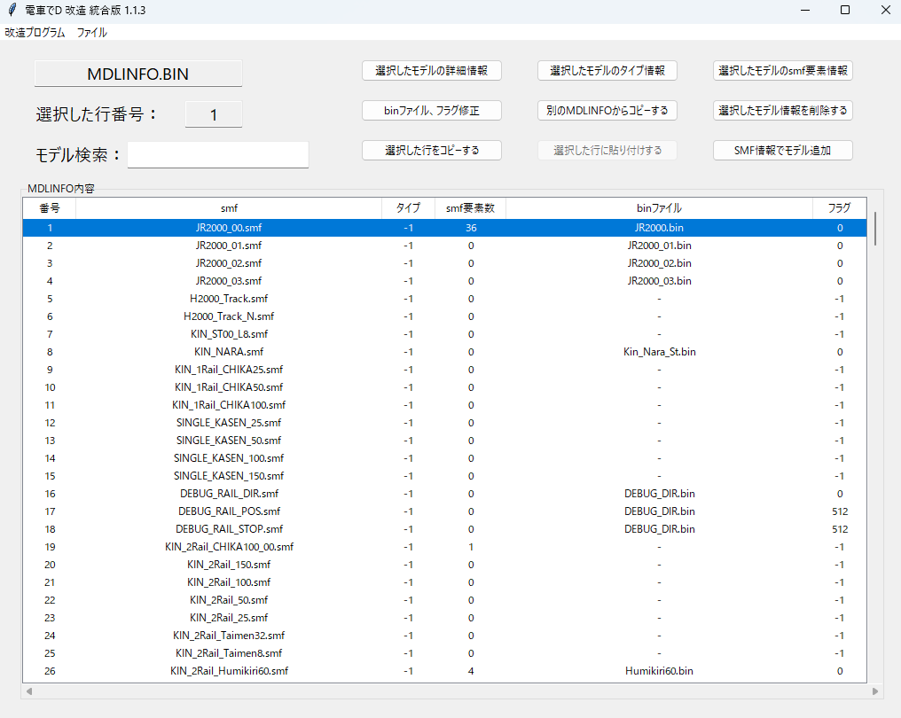
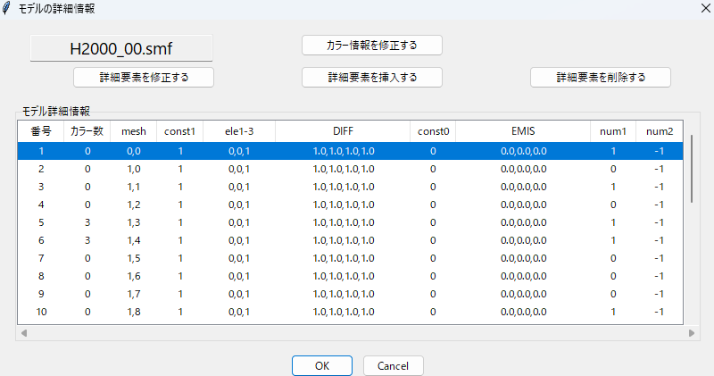
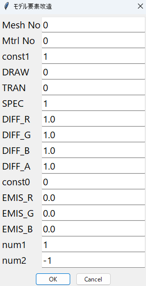

# MDLINFO

## 実行方法

メニュの「ファイルの開く」で指定のBINファイルを開く。

必ず、プログラムが書込みできる場所で行ってください

### モデル検索

単語を入力すると、自動でリストを絞って表示する

### モデル要素の編集

1. 「カラー情報を修正する」ボタンで、保存されているカラー(イメージ情報)を修正する

2. 「詳細要素を修正する」ボタンで、下記の情報を修正できる

### モデルのタイプ編集【推定】

モデルのタイプ編集ができる。

### smf要素の編集

SMFに定義されている要素を編集できる

### binファイル、フラグの編集

モデル名、モデルバイナリファイル、フラグを編集できる

### 別のMDLINFOからモデル情報コピー

別のMDLINFOファイルを開いて、そこに定義されているモデル情報を

編集しているファイルにコピーする。

ただし、必ず最終番に追加される

### モデル情報を削除

モデル情報を削除する。一度削除すると元に戻らない。

### 選択した行をコピーする

選択した行のモデル情報をコピーする。

### 選択した行に貼り付けする

選択した行にモデル情報を貼り付けする。

### SMF情報でモデル追加

選択したSMFモデルでメッシュ情報を追加する。

デフォルトで値を入れているので、必ずちゃんと動く保証はない。

### FAQ

* Q. 電車でDのゲームがあるが、指定したBINファイルがない。  

  * A. PackファイルをGARbro のような、アーカイバで展開すると得られる。

  * A. GARbro を使用して空パスワードで解凍すると無効なファイルになるので、適切なパスワードを入力すること。

* Q. BINファイルを指定しても、「電車でDのファイルではない、またはファイルが壊れた可能性があります。」と言われる

  * A. 抽出方法が間違っているか、抽出時のパスワードが間違っているのでは？作業工程をやり直した方がよい。

* Q. BINファイルを改造しても、変化がないけど？

  * A. 既存のPackファイルとフォルダーが同時にあるなら、Packファイルを優先して読み込んでいる可能性がある。

    読み込みしないように、抽出したPackファイルを変更するか消そう。

* Q. ダウンロードがブロックされる、実行がブロックされる、セキュリティソフトに削除される

  * A. ソフトウェア署名などを行っていないので、ブラウザによってはダウンロードがブロックされる

  * A. 同様の理由でセキュリティソフトが実行を拒否することもある。

以上。