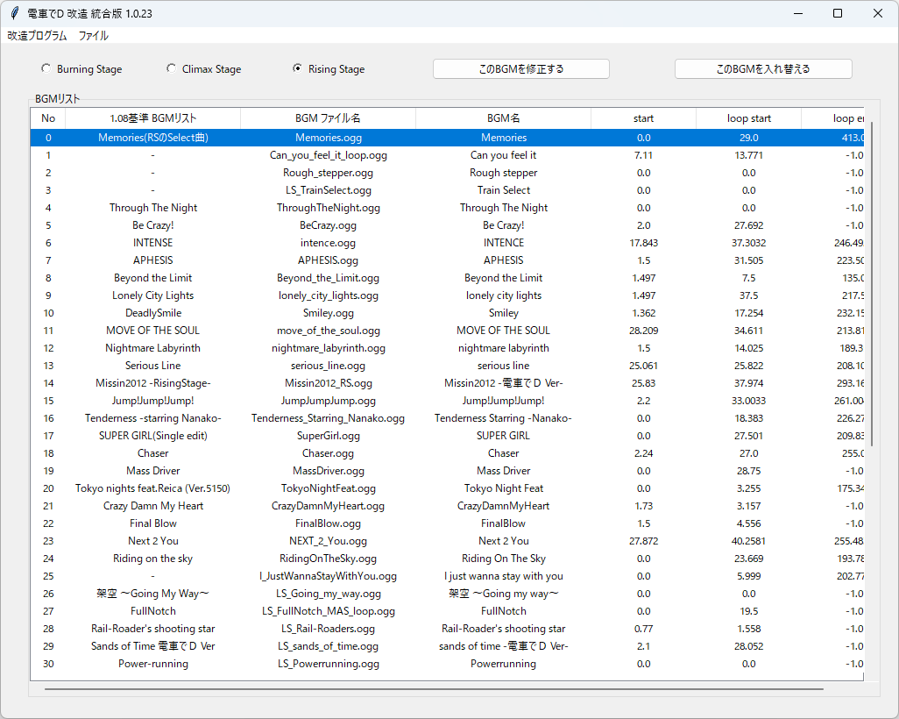

# BGMリスト

## 実行方法

### BGMリスト編集方法

1. メニュの「ファイルの開く」でバイナリファイルを開く。

    Burning Stageは、「LS_INFO.BIN」を開く

    Climax Stageは、「SOUNDTRACK_INFO.BIN」を開く

    Rising Stageは、「SOUNDTRACK_INFO_4TH.BIN」を開く。

    必ず、プログラムが書込みできる場所で行ってください

2. 編集したい行を選ぶ

3. 「このBGMを修正する」ボタンで、BGMファイル名や、時間を修正する

4. 「このBGMを入れ替える」ボタンで、リストにある別の行と入れ替える

### FAQ

* Q. 電車でD ゲームがあるのに、 指定のバイナリファイル が無い。 
  
  * A. Rising Stageまでの旧作は、Packファイルを

    GARbro のような、アーカイバで展開すると得られる。

  * A. GARbro を使用して空パスワードで解凍すると無効なファイルになるので、適切なパスワードを入力すること。

* Q. BINファイルを指定しても、「予想外のエラーが出ました。電車でDのファイルではない、またはファイルが壊れた可能性があります。」と言われる

  * A. 抽出方法が間違っているか、抽出時のパスワードが間違っているのでは？作業工程をやり直した方がよい。

* Q. BINファイルを改造しても、変化がないけど？

  * A. Rising Stageまでの旧作は、既存のPackファイルとフォルダーが同時にあるなら、

    Packファイルを優先して読み込んでいる可能性がある。

    読み込みしないように、抽出したPackファイルを変更するか消そう。

* Q. ダウンロードがブロックされる、実行がブロックされる、セキュリティソフトに削除される

  * A. ソフトウェア署名などを行っていないので、ブラウザによってはダウンロードがブロックされる

  * A. 同様の理由でセキュリティソフトが実行を拒否することもある。

以上。