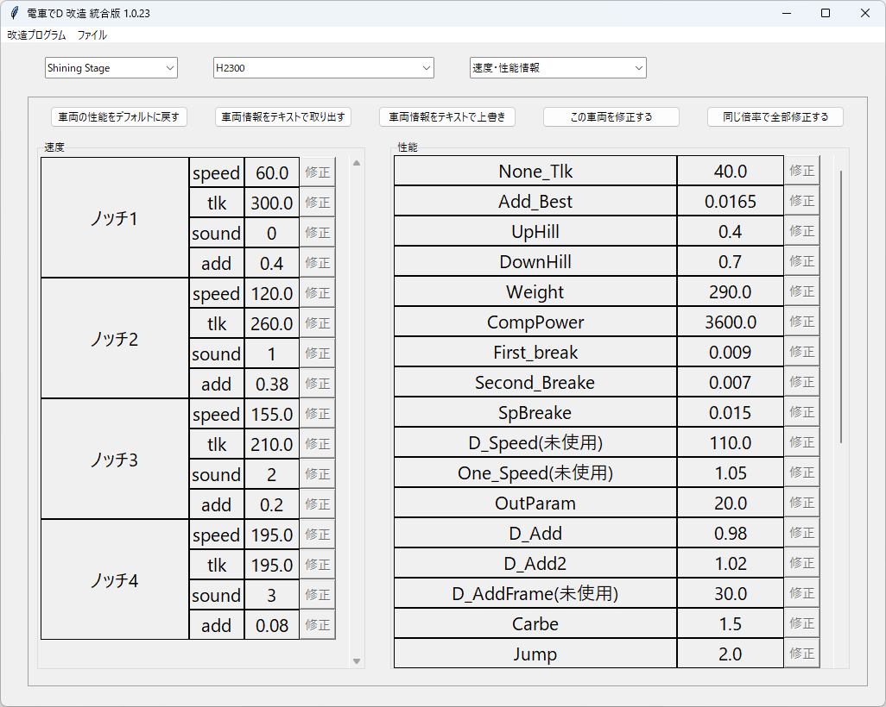

# 車両改造

## 実行方法

1. プルダウンで、ゲームを選ぶ。初期状態は「Shining Stage」になっている。

2. メニュの「ファイルの開く」でBINファイルを開く。

    Lightning Stageは「TRAIN_DATA.BIN」

    Burning Stageは「TRAIN_DATA2ND.BIN」

    Climax Stageは「TRAIN_DATA3RD.BIN」

    Rising Stageは「TRAIN_DATA4TH.BIN」を開く。

    Shining Stageは「train_org_data.den」を開く。

    必ず、プログラムが書込みできる場所で行ってください

3. リストにある車両を選ぶ

4. 改造したい項目を選ぶ。「速度・性能情報」、「数・モデル情報」、「レンズフレア」から選べる

    Shining Stageは「速度・性能情報」、「数・その他情報」から選べる。

## ステージ情報変更方法

※Burning Stage、Climax Stage、Rising Stageのみできる。

1. ステージを選んだとき、デフォルトで適用する車両を変更できる。

2. Climax Stage以降は、台車も設定できる。

3. OKをクリックすると、すぐ保存される。

## 速度・性能変更方法

1. 「車両の性能をデフォルトに戻す」ボタンで、速度、または性能を全部デフォルト数値に戻すことができる。

2. 「車両情報をCSVで取り出す」ボタンで、車両情報をCSV出力する。

    一部、else以外の情報を全て取り出せる。

    Shining Stageの場合、「車両情報をテキストで取り出す」ボタンで、

    格納されたテキストそのまま出力する。

3. 「車両情報をCSVで上書き」ボタンで、車両情報を改造できる。

    一部、else以外の情報を全て上書きして改造できる。

    Shining Stageの場合、「車両情報をテキストで上書き」ボタンで、

    テキストを上書きして格納する。

4. 「この車両を修正する」ボタンで、速度や性能の修正ボタンが活性化される。

    修正している間には、車両を選ぶことができない。

5. 「保存する」ボタンで、修正した速度や性能を保存できる。

6. 「同じ倍率で全部修正する」ボタンで、性能のある数値を

    x倍、またはx値で全車両修正できる。

7. 数値を改造した場合、デフォルトより高いと赤色に、低いと青色になる。

## (旧作)数・モデル情報変更方法

1. 車両の枠は編成やカラーの数、各編成に適用するモデル、パンタ、COLを設定できる。

2. ノッチを変更すると、速度の枠の情報も変更される。

    ノッチを増やした場合、増やした分はデフォルトで0になる。

3. 編成数を変更すると、右にある各車両の編成情報も変更される。

4. カラー数は、CS以後のファイルの場合、数のみ変更できる。

    LSはカラー数がないためサポート対象外、BSはCSVのみで改造できる。

5. 「この編成を修正する」ボタンで、右にある各車両の編成情報を修正できる。

6. 「保存する」ボタンで、右にある各車両の編成情報を保存できる

7. 「モデル情報の修正」ボタンで、設定されているモデル情報を変更できる

    この機能は、CSとRSのみできる。

8. 他にelse情報なども修正できる。

## (旧作)モデル情報変更方法

※Climax Stage、Rising Stageのみできる。

1. 車両の枠にある「モデル情報を修正」をクリックするとできる。

2. リストボックスをクリックして、修正、挿入、削除ができる。

    ただし、設定されているモデル、パンタ、COLは削除できない。

3. OKをクリックすると、各車両に設定したモデル情報が更新される。

## (旧作)レンズフレア情報変更方法

1. レンズフレア情報と、テールランプの情報を修正できる

## 数・その他情報変更方法

1. ノッチ・性能情報以外の、車両に関する性能を改造できる

### FAQ

* Q. 電車でDのゲームがあるが、指定したBINファイルがない。  
  
  * A. Lightning StageはDenD_Data102.Pack、

    Burning StageはPach006_ALL.Pack、

    Climax StageはPatch004.Pack、

    Rising StageはPatch_4th_4を

    GARbro のような、アーカイバで展開すると得られる。
  * A. GARbro を使用して空パスワードで解凍すると無効なファイルになるので、適切なパスワードを入力すること。

* Q. BINファイルを指定しても、「電車でDのファイルではない、またはファイルが壊れた可能性があります。」と言われる

  * A. 抽出方法が間違っているか、抽出時のパスワードが間違っているのでは？作業工程をやり直した方がよい。

* Q. BINファイルを改造しても、変化がないけど？

  * A. 既存のPackファイルとフォルダーが同時にあるなら、Packファイルを優先して読み込んでいる可能性がある。

    読み込みしないように、抽出したPackファイルを変更するか消そう。

* Q. ダウンロードがブロックされる、実行がブロックされる、セキュリティソフトに削除される

  * A. ソフトウェア署名などを行っていないので、ブラウザによってはダウンロードがブロックされる
  * A. 同様の理由でセキュリティソフトが実行を拒否することもある。

* Q. 編成数を伸ばしてみたら、エラーになる

  * A. ステージの初期配置位置から逆算して電車を構築するため、

    後ろに十分なレール領域がないと、エラーになる。

    また、Lightning Stage、Burning Stageは、理論上、無限に伸ばせるが

    Climax Stageは、1Pの場合、最大8両まで、

    Rising Stageは、1Pの場合、最大10両まで伸ばすことができる。

    2Pは（CPUのみ）、理論上、無限に伸ばせる。

以上。