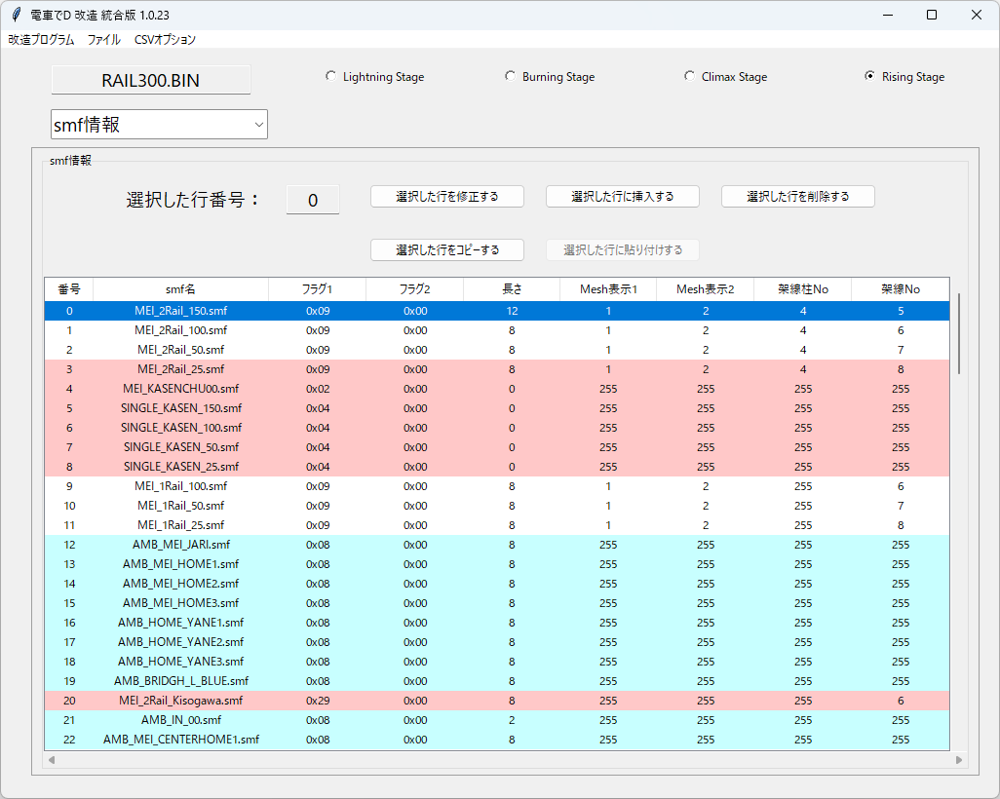
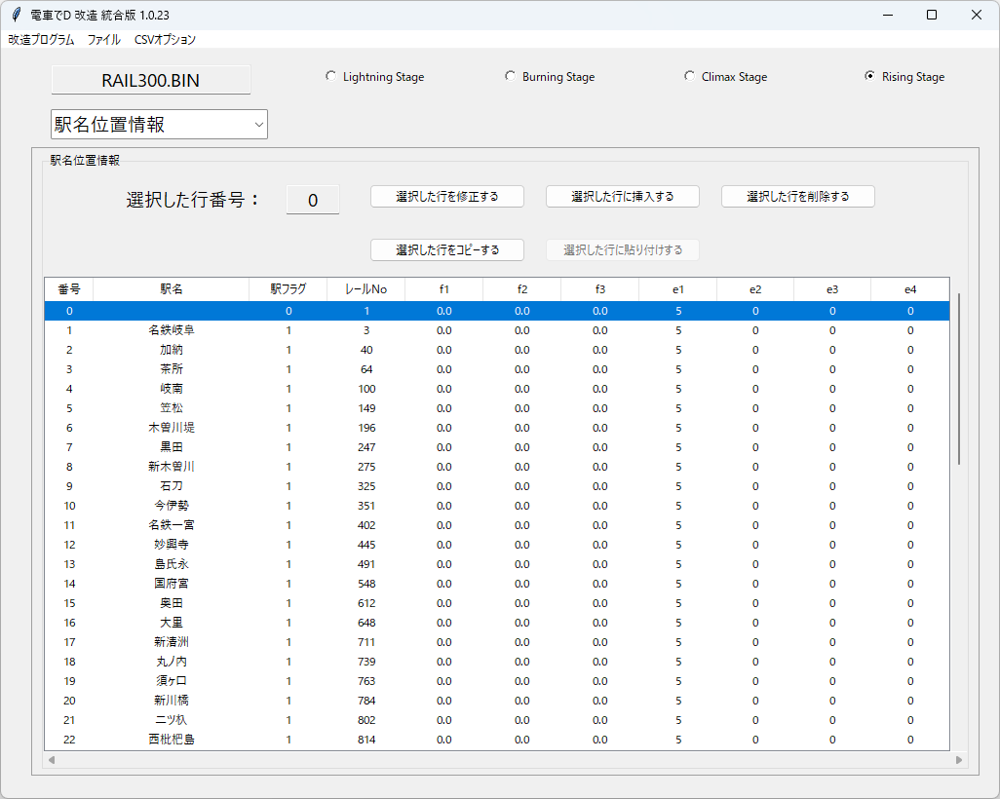
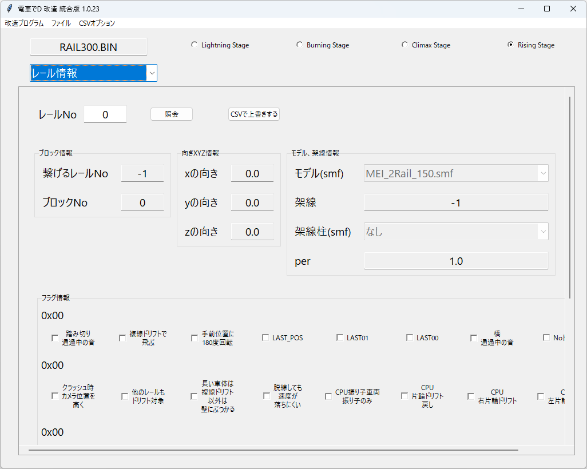

# レールエディター

## 実行方法

メニュの「ファイルの開く」で指定のBINファイルを開く。

必ず、プログラムが書込みできる場所で行ってください

レールバイナリにある情報を修正できるようになる。

また、エクセルでレールデータを取り出し、上書きすることができる。

LS体験版のファイルも読み込めるが、ここでは要素の説明を省略する。

### BGM、配置情報

BGMの数、登場させる車両の数、

それぞれ初期配置の位置を調整できる

 * BGMの数

   LS：必ず1個。バトルで流したいBGMの詳細を定義する。ただし、loopEnd要素がない 
   BS：旧作の名残り。ここを修正しても反映されず、LS_INFO.binファイルを修正する必要がある 
   CS、RS：ステージで読込する「BGMの数」のみ定義する

 * 車両数

   LS：読込する車両の数を定義する。ただし、どの車両を読込するかまでは定義できない 
   BS、CS、RS：ストーリーモードで読込する車両の数を定義する。これによって、初期配置の数も変わる

 * 初期位置

   ストーリーモードで読込んだ車両をどのレールに配置するか定義する。 
   この配置は先頭車の一番前の台車基準であり、編成が長い車両も考慮して配置するべきであり、スペースが足りないとエラーで落ちる

 * ダミー配置？

   ダミーデータ。修正しても影響はない。

 * 試運転、二人バトル配置

   試運転、あるいは二人バトルで読込んだ車両をどのレールに配置するか定義する。

 * 初期駅表示No

   右上の駅表示を、どの駅から表示し始めるかindex番号で定義する。

 * (BSのみ)「ダミー配置？と初期駅表示No」

   修正しても影響はない。

### 要素１

夜景や背景、ddsや駅名標の定義、binファイルのアニメを調整できる

 * else1

   ステージの空・空の色に関するものと思われる。詳しい仕様は不明

 * light情報(BS、CS、RS)

   電車でDのゲームエンジンで読込する、Directx9のddsファイル情報

 * 駅名標画像情報(CS、RS)

   カスタムの駅名標のための、画像ファイル情報

 * 駅名標位置情報(CS、RS)

   ①const0：詳細不明 
   ②AMB番号：AMBのindex番号 
   ③AMB子番号：AMBの子番号。-1から数えてモデルを確定させる。 
   ④ele：詳細不明 
   ⑤画像番号：駅名標画像情報で定義した画像のindex番号

 * ベースbin情報（BS、CS、RS）

   ANIMEを適用するためのbinファイル情報

 * ベースbin ANIME

   ANIME数：ステージで適用するANIMEの数を決める 
   ①const1：【推測】ベースbin情報の1番目のindex。LSの場合は1固定で、「SCENE3DOBJ.BIN」を使う 
   ②param1：binファイルに定義されたANIME番号１ 
   ③param2：binファイルに定義されたANIME番号２

### smf情報

ステージで使用するsmfのリストを調整できる

 * LSの場合

   ⓪番号：読込するsmfのindex番号 
   ①smf名：読込するsmfファイル名を定義する 
   ②長さ：smfのボーンの個数を定義する。モデルによってない場合もある 
   ③e1：【推測】表示するMeshをindexで定義。255の場合、全部表示する 
   ④リスト数：smfモデルに適用するANIME効果を定義する

   * 「選択した行のリストを修正する」

     ①binファイルに定義されたANIME番号１ 
     ②binファイルに定義されたANIME番号２ 

     smfで事前に定義された位置に「SCENE3DOBJ.BIN」にあるANIME効果を適用する。 
     このANIME効果は、ほぼモデル周りの踏切である。

 * BSの場合

   ⓪番号：読込するsmfのindex番号 
   ①smf名：読込するsmfファイル名を定義する 
   ②長さ：smfのボーンの個数を定義する。モデルによってない場合もある 
   ③Mesh表示1：【推測】表示するMeshをindexで定義。255の場合、全部表示する 
   ④Mesh表示2：【推測】表示するMeshをindexで定義。255の場合、全部表示する 
   ⑤リスト数：smfモデルに適用するANIME効果を定義する

   * 「選択した行のリストを修正する」

     ①モデル（レール）のボーン位置 
     ②binファイルに定義されたANIME番号１ 
     ③binファイルに定義されたANIME番号２ 

     smfの指定したボーンの位置にANIME効果を適用する。 
     このANIME効果は、ほぼモデル周りの踏切である。

 * CS、RSの場合

   ⓪番号：読込するsmfのindex番号 
   ①smf名：読込するsmfファイル名を定義する 
   ②フラグ１：モデルのデフォルト属性を付与する 
   ③フラグ２：モデルにぶつけた際などの制限事項を適用する 
   ④長さ：smfのボーンの個数を定義する。モデルによってない場合もある 
   ⑤Mesh表示1：【推測】表示するMeshをindexで定義。255の場合、全部表示する 
   ⑥Mesh表示2：【推測】表示するMeshをindexで定義。255の場合、全部表示する 
   ⑦架線柱No：デフォルトで適用する架線柱モデルのindex番号 
   ⑧架線No：デフォルトで適用する架線モデルのindex番号

### 駅名位置情報

ゲームの右上に現れる駅名をどの位置で表せるか調整できる

 * LSの場合

   ⓪番号：駅名のindex番号 
   ①駅名：駅名を定義する 
   ②駅フラグ：属性を定義する 
     * 駅フラグの種類 
       0（スタート） 
       1（デフォルト） 
       2（ゴール）：ゴール判定に使う

   ③レールNo：どのレールで表示させるか定義する 
   ④～⑨：詳細不明

 * BSの場合

   ⓪番号：駅名のindex番号 
   ①駅名：駅名を定義する 
   ②駅フラグ：属性を定義する 
     * 駅フラグの種類 
       0（スタート） 
       1（デフォルト） 
       2（ゴール）：ゴール判定に使う 
       3（セーブ）：Quick Saveできるようになる

   ③レールNo：どのレールで表示させるか定義する 

 * CS、RSの場合

   ⓪番号：駅名のindex番号 
   ①駅名：駅名を定義する。 
   　CSではオプションで「駅名非表示対策」をONにすると反映されない 
   　RSからは完全に画像表示になったため、ここを修正しても反映されない 
   ②駅フラグ：属性を定義する 
     * 駅フラグの種類 
       0（スタート） 
       1（デフォルト） 
       2（ゴール）：ゴール判定に使う

   ③レールNo：どのレールで表示させるか定義する 
   ④～⑩：詳細不明

### 要素２

未詳

### CPU情報

レール位置によって、CPUの速度を調整できる

 * LSの場合

   ⓪番号：cpuのindex番号 
   ①レールNo：どのレールでcpuモードを適用するか定義する 
   ②list1：詳細不明 
   ③const1：cpu（１）のことを指す。 
   ④mode：cpuモードを設定する。モードの詳しい説明は、[【こちら】](https://khttemp.github.io/dendData/comicscript/cpuMode/cpuMode.html)を参照 
   ⑤minLen：cpuの「最低距離」を設定する 
   ⑥maxLen：cpuの「最高距離」を設定する 
   ⑦maxSpeed：cpuの「最高速度」を設定する 
   ⑧minSpeed：cpuの「最低速度」を設定する 
   ⑨defSpeed：cpuの「デフォルト速度」を設定する 
   ⑩list2：詳細不明

 * BSの場合

   ⓪番号：cpuのindex番号 
   ①レールNo：どのレールでcpuモードを適用するか定義する 
   ②const1：cpu（１）のことを指す。 
   ③mode：cpuモードを設定する。モードの詳しい説明は、[【こちら】](https://khttemp.github.io/dendData/comicscript/cpuMode/cpuMode.html)を参照 
   ④minLen：cpuの「最低距離」を設定する 
   ⑤maxLen：cpuの「最高距離」を設定する 
   ⑥maxSpeed：cpuの「最高速度」を設定する 
   ⑦minSpeed：cpuの「最低速度」を設定する 

 * CSの場合

   ⓪番号：cpuのindex番号 
   ①レールNo：どのレールでcpuモードを適用するか定義する 
   ②const1：cpu（１）のことを指す。 
   ③mode：cpuモードを設定する。モードの詳しい説明は、[【こちら】](https://khttemp.github.io/dendData/comicscript/cpuMode/cpuMode.html)を参照 
   ④minLen：cpuの「最低距離」を設定する 
   ⑤maxLen：cpuの「最高距離」を設定する 
   ⑥maxSpeed：cpuの「最高速度」を設定する 
   ⑦minSpeed：cpuの「最低速度」を設定する 
   ⑧defSpeed：cpuの「デフォルト速度」を設定する

 * RSの場合

   ⓪番号：cpuのindex番号 
   ①レールNo：どのレールでcpuモードを適用するか定義する 
   ②const1：cpu（１）のことを指す。 
   ③mode：cpuモードを設定する。モードの詳しい説明は、[【こちら】](https://khttemp.github.io/dendData/comicscript/cpuMode/cpuMode.html)を参照 
   ④minLen：cpuの「最低距離」を設定する 
   ⑤maxLen：cpuの「最高距離」を設定する 
   ⑥maxSpeed：cpuの「最高速度」を設定する 
   ⑦minSpeed：cpuの「最低速度」を設定する 

### ComicScript、土讃線

ステージで使うコミックスクリプトの定義

CS、RSの場合、土讃線スペシャルラインを調整できる

 * コミックスクリプト

   ストーリー、バトル、試運転のどのモードでも
   
   順番的に、1番目に定義されたスクリプトは必ず読み込む。

   ①コミック番号：「comic3000.bin」など、読込するコミックスクリプトの番号を定義する 
   ②イベントタイプ：スクリプトを発動させるイベントタイプを定義する 
     * イベントタイプの種類 
       0（Player） 
       　普段は、ストーリーのみのスクリプト。 
       　プレイヤー基準で、設定したレールに到達した場合、自動で動作する。 
       　レール位置を「-1」にすることで、自動で動作することを防ぎ、「GOTO_SCRIPT」で呼び出したいときに使う 
       1（CPU） 
       　ストーリーのみのスクリプト。 
       　CPU基準で、設定したレールに到達した場合、自動で動作する。 
       2（Fast） 
       　ストーリーのみのスクリプト。 
       　PlayerまたはCPUのどちらか、設定したレールに到達した場合、自動で動作する。 
       ３（Goal） 
       　ストーリー、試運転、バトルどこでも使うスクリプト。 
       　どのレールで、ゴールを配置するかなどに使う。 
       　普段、レール位置は「-1」になり、タイプ４と同時に動く。 
       　CS、RSでは、「comic2990.bin」がよく使われる 
       ４（GoalEvent） 
       　ストーリーのみのスクリプト。BSから使われる。 
       　ストーリーでGoalのイベントがあり、ゴールに達したとき、動作させるスクリプト。 
       　普段、レール位置は「-1」になり、タイプ３と同時に動く。 
       ５（Event） 
       　同時に発動させるためのスクリプト。BSから使われる。 
       　順番的に一番早いスクリプトを先に読み込む。 

   ③レール位置：スクリプトをどこで発動させるかのレール位置を定義する

 * 土讃線情報（CS、RS）

   この情報は、土讃線が出来る区間を定義するだけで、コマンド入力で土讃線ジャンプをする場合は

   レールデータのフラグでまた定義する必要がある。

   ①始め 
   　土讃線ジャンプを始められる区間 
   　順番に、「レールNo、startのボーンNo、endのボーンNo」を定義する。 
   ②着地 
   　土讃線ジャンプした後、着地する区間 
   　順番に、「レールNo、startのボーンNo、endのボーンNo」を定義する。 
   　endのボーンNoは、使われないデータと思われる。 
   ③～：詳細不明

### レール情報

ステージで使う、実際に走る線路の情報を見れる

修正するには、エクセルかCSVを利用して調整する

RSのレール情報の要素についは、[【こちら】](/program/railEditor/raildata.md)のリンクを参照

### 要素３(LSの場合、Cam)

指定のレール、または架線柱に

モデルを置き、ANIME効果を適用する。

 * LSの場合

   【推測】プレイヤーが絶対座標で指定した場所を過ぎた場合、カメラ効果を適用する

   ⓪番号：camのindex番号 
   ①f1~f3：【推測】絶対座標 
   ②数：通過した場合、適用するカメラ効果の数

   * Camリスト

     ⓪番号：Camリストのindex番号 
     ①f1~f3：【推測】絶対座標 
     ②f4：カメラ効果を適用するフレーム 
     ③b1：LSのカメラタイプ

 * BS、CS、RSの場合

   ⓪番号：要素３のindex番号 
   ①レールNo：どのレールで適用するか定義する 
   ②数：適用するANIME効果の数

   * 要素３リスト

     ⓪番号：要素３リストのindex番号 
     ①タイプ：ANIME効果を適用する箇所 
       　0：【LS、BSのみ】モデルの中央(smfを直で指定) 
       　1：レール 
       　2：架線柱 
       　6：レールのボーン 
     ②railPos
       　タイプで１や２の場合、SMFに定義されたNの位置。（ex:2を指定した場合、【N2】に置く）
       　タイプが6の場合、レールのボーン 
     ③bin index：ベースbin情報のindex 
     ④anime1：ANIME番号１ 
     ⑤anime2：ANIME番号２

### 要素４

[【こちら】](/program/railEditor/raildata.md)のリンクを参照

### AMB情報

ステージで使う、オブジェクト扱いのAMBの情報を見れる

修正するには、エクセルかCSVを利用して調整する

RSのAMB情報の要素についは、[【こちら】](/program/railEditor/ambdata.md)のリンクを参照

 * LSの場合

   BS以後の「要素３」と考えても良い。

   ⓪番号：AMBのindex番号 
   ①レールNo：どのレールで適用するか定義する 
   ②タイプ：ANIME効果を適用する箇所 
    　0：モデルの中央(smfを直で指定) 
    　1：レールの横 
    　2：架線柱 
    　6：レールのボーン 
   ③railPos：指定レールのボーン 
   ④anime1：ANIME番号１。タイプ０の場合、smfのindex番号 
   ⑤anime2：ANIME番号２。タイプ０の場合、【-1】固定

 * BSの場合

   RSと違って、子モデルがない。

   あるレールとボーンの位置を基準に並行移動したXYZと

   回転したXYZと、PERのみで定義されている。

 * CSの場合

   RSと同じ

### xlsx読込み・書込みオプション

エクセルで取り出す・上書きする際にオプションを選択できる。

* モデルを名称として出力、あるいは絶対値のindexで出力する。

* フラグの要素を10進数で、あるいは16進数で出力・入力する。

* AMBの出力結果を、AMBモデルの情報単位で改行、あるいは全部１行で出力・入力する。

### FAQ

* Q. 電車でDのゲームがあるが、指定したBINファイルがない。  

  * A. PackファイルをGARbro のような、アーカイバで展開すると得られる。

  * A. GARbro を使用して空パスワードで解凍すると無効なファイルになるので、適切なパスワードを入力すること。

* Q. BINファイルを指定しても、「電車でDのファイルではない、またはファイルが壊れた可能性があります。」と言われる

  * A. 抽出方法が間違っているか、抽出時のパスワードが間違っているのでは？作業工程をやり直した方がよい。

* Q. BINファイルを改造しても、変化がないけど？

  * A. 既存のPackファイルとフォルダーが同時にあるなら、Packファイルを優先して読み込んでいる可能性がある。

    読み込みしないように、抽出したPackファイルを変更するか消そう。

* Q. ダウンロードがブロックされる、実行がブロックされる、セキュリティソフトに削除される

  * A. ソフトウェア署名などを行っていないので、ブラウザによってはダウンロードがブロックされる

  * A. 同様の理由でセキュリティソフトが実行を拒否することもある。

以上。