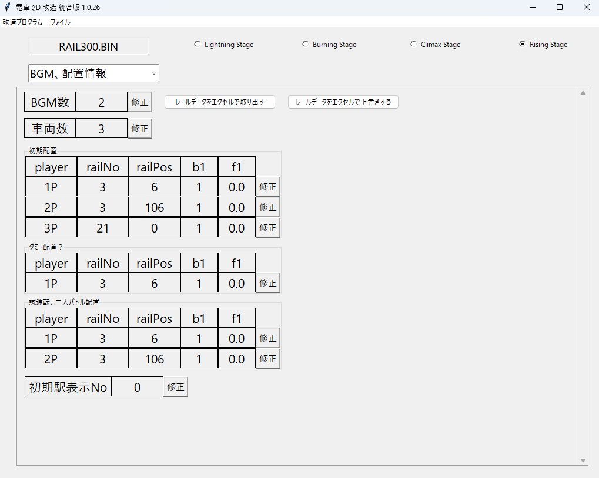
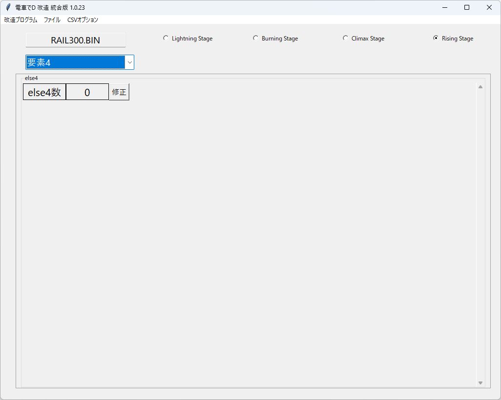
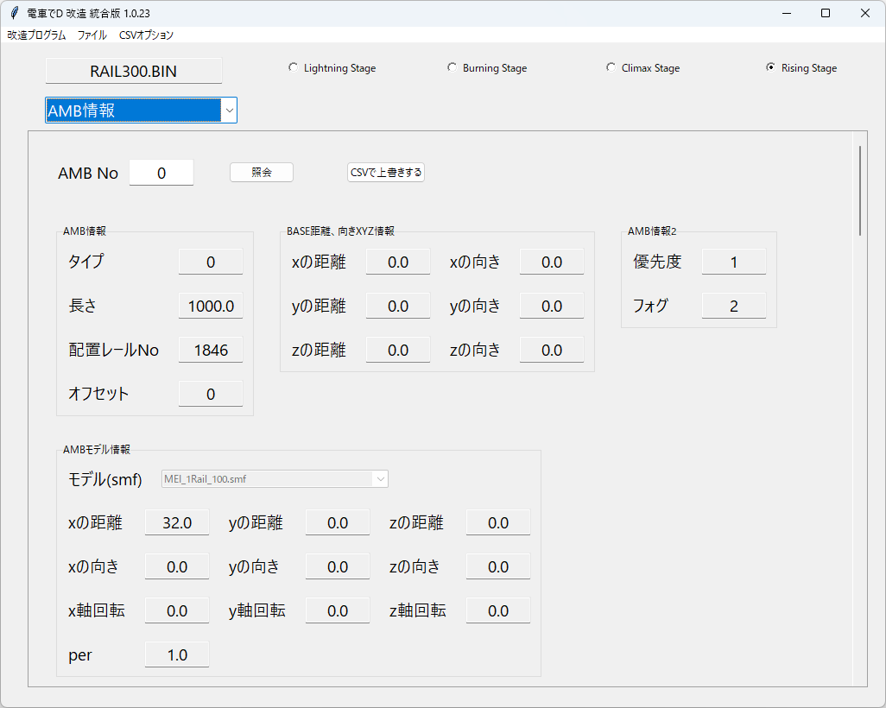
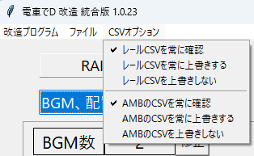

# レールエディター

## 実行方法

メニュの「ファイルの開く」で指定のBINファイルを開く。

必ず、プログラムが書込みできる場所で行ってください

レールバイナリにある情報を修正できるようになる。

また、レール情報、AMB情報のCSVを自動で作成する。

### BGM、配置情報

BGMの数、登場させる車両の数、

それぞれ初期配置の位置を調整できる

### 要素１

else1の機能は、夜景や背景の調整と思われる。

ddsや駅名標の定義、binファイルのアニメを調整できる

### smf情報

ステージで使用するsmfのリストを調整できる

### 駅名位置情報

ゲームの右上に現れる駅名をどの位置で表せるか調整できる

### 要素２

未詳

### CPU情報

レール位置によって、CPUの速度を調整できる

### ComicScript、土讃線

ステージで使うコミックスクリプトの定義

土讃線スペシャルラインを調整できる

### レール情報

ステージで使う、実際に走る線路の情報を見れる

修正するには、自動で作られたCSVを利用して調整する

RSのレール情報の要素についは、[【こちら】](/raildata.md)のリンクを参照

### 要素３

未詳

### 要素４

未詳

### AMB情報

ステージで使う、オブジェクト扱いのAMBの情報を見れる

修正するには、自動で作られたCSVを利用して調整する

### CSVオプション

レールエディターは、自動でCSVを書き込む。

オプションは、前に作成したCSVファイルが存在する時、処理オプションを選択できる。

設定は、ファイルを開く時に適用される。

デフォルトは、必ずファイルを確認するオプションになっている。

### FAQ

* Q. 電車でDのゲームがあるが、指定したBINファイルがない。  

  * A. PackファイルをGARbro のような、アーカイバで展開すると得られる。

  * A. GARbro を使用して空パスワードで解凍すると無効なファイルになるので、適切なパスワードを入力すること。

* Q. BINファイルを指定しても、「電車でDのファイルではない、またはファイルが壊れた可能性があります。」と言われる

  * A. 抽出方法が間違っているか、抽出時のパスワードが間違っているのでは？作業工程をやり直した方がよい。

* Q. BINファイルを改造しても、変化がないけど？

  * A. 既存のPackファイルとフォルダーが同時にあるなら、Packファイルを優先して読み込んでいる可能性がある。

    読み込みしないように、抽出したPackファイルを変更するか消そう。

* Q. ダウンロードがブロックされる、実行がブロックされる、セキュリティソフトに削除される

  * A. ソフトウェア署名などを行っていないので、ブラウザによってはダウンロードがブロックされる

  * A. 同様の理由でセキュリティソフトが実行を拒否することもある。

以上。