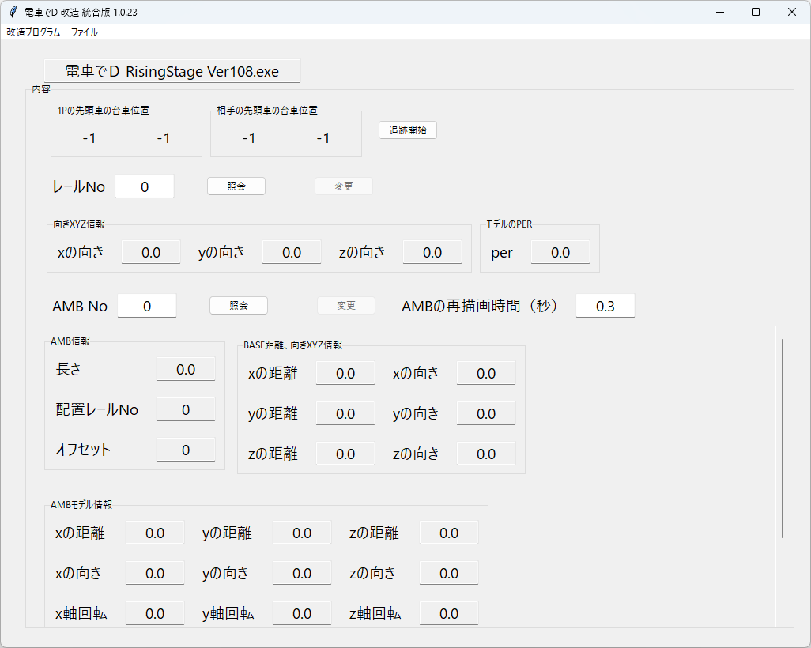

# RSのレール・AMB

## 実行方法

メニュの「ファイルの開く」でRisingStageの実行ファイルを開く。

必ず、1.08の最新バージョンを開くこと。

また、メモリーを参照、上書きする動作なので、管理者権限で実行すること。

リアルタイムで、レールとAMBの配置をプレビューするための機能である。

### レール位置を追跡する

追跡開始のボタンで、リアルタイムで1Pと2Pのレール位置を表示する。

追跡終了ボタンに変わり、もう1回押すと、追跡を終了する。

### レールデータを修正する

修正できるレール要素は、

dir_x、dir_y、dir_z、perの4つのみ。

修正後、すぐには反映されない、または変な描画をするため

再描画できるように、行ったり来たりする必要がある。

### AMBを修正する

修正できるレール要素は、

length、rail_no、rail_pos

base_pos_x,y,z / base_dir_x,y,z

そして、親AMBと子AMBの

pos_x,y,z / dir_x,y,z / dir2_x,y,z / perのみである。

修正後、並行移動要素のpos以外

すぐには反映されない、または変な描画をするため

再描画できるように、行ったり来たりする必要がある。

### FAQ

* Q. ダウンロードがブロックされる、実行がブロックされる、セキュリティソフトに削除される

  * A. ソフトウェア署名などを行っていないので、ブラウザによってはダウンロードがブロックされる

  * A. 同様の理由でセキュリティソフトが実行を拒否することもある。

以上。