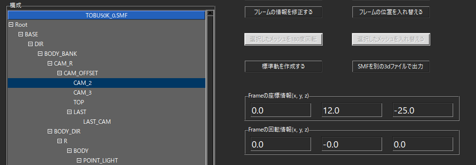
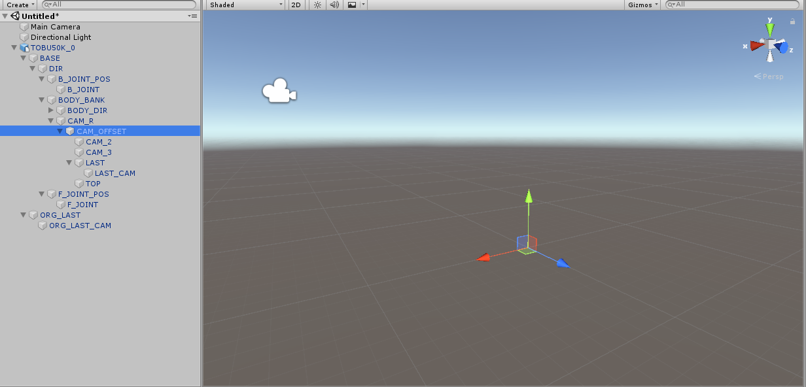
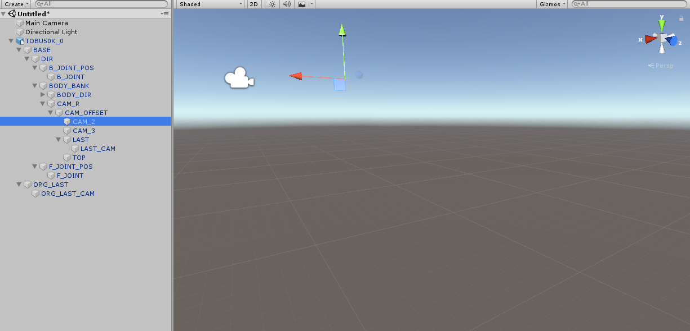
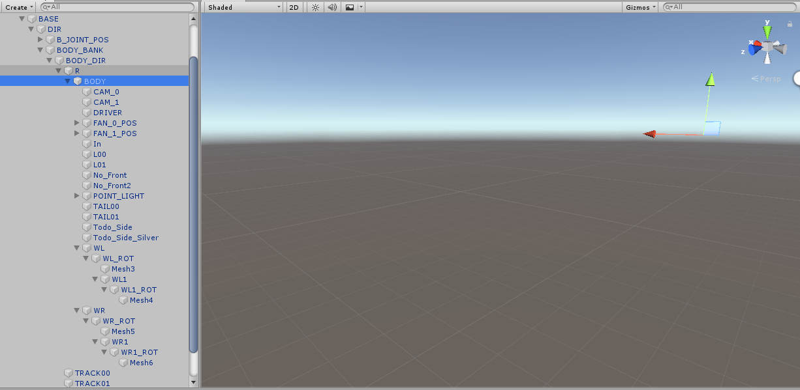
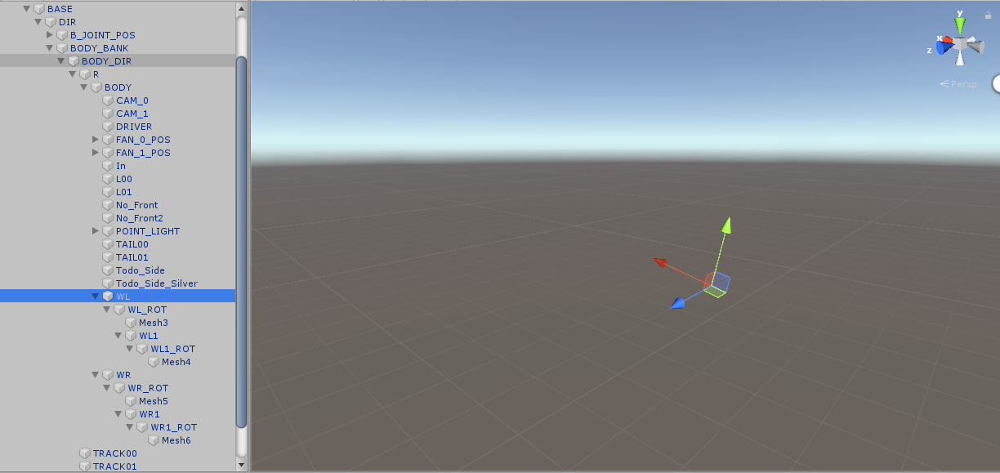
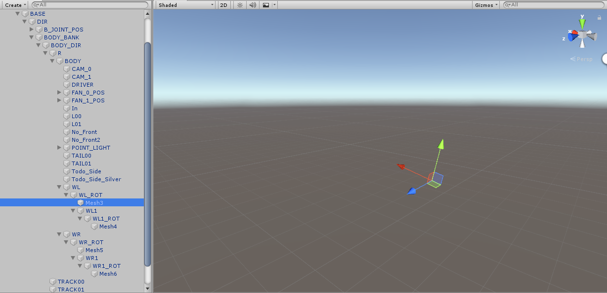
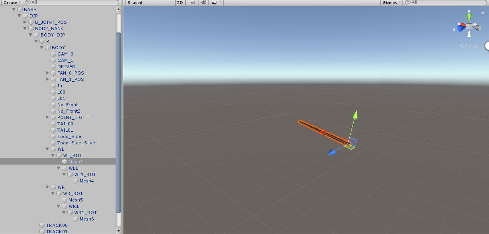
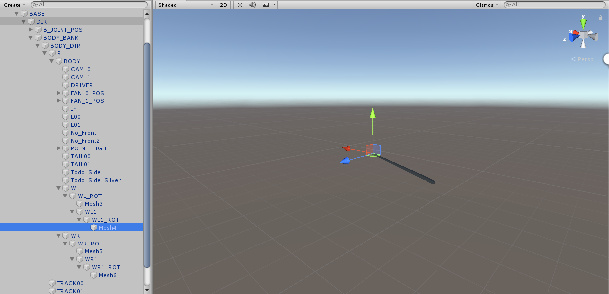
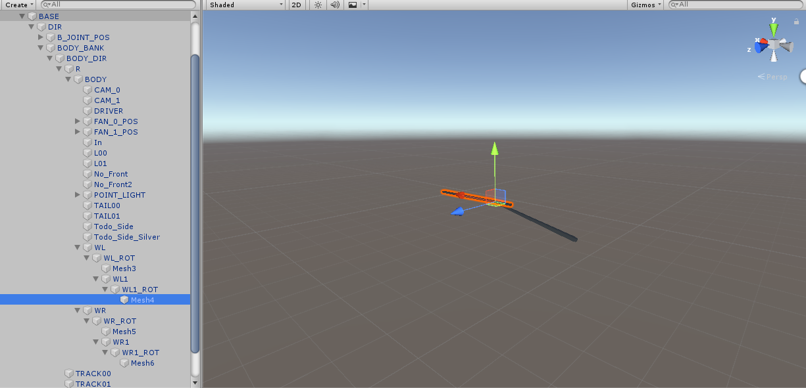

# フレームとメッシュについて

## フレームとは

SMFのそれぞれのフレームの構造は、基本的にUnityのFBXと同じ。

例えば、CAM_2のフレームは

親のCAM_OFFSETを基準に、「(0, 12, -25)」ほど移動した位置にある

（Unityで再現したCAM_OFFSETの位置）

（Unityで再現したCAM_2の位置）

## メッシュとは

座標、その座標が3つ集まったポリゴン、

そのポリゴンの法線情報、UV情報、マテリアルなどを定義した情報

要するにこの情報を使って、「目に見えるモデル」を作成できる。

あるフレームがメッシュを指定しているとき、

そのフレームの位置情報、回転情報はメッシュにとって原点となる。

例えば、ワイパーのメッシュは

まず、BODYを原点に

(-2.52296, -0.6191, 19.4661)ほど平行移動して

(0.0, -2.3, 12)ほど回転した位置に「WL」のフレームを置く

次に、WLを原点に

制御用の「WL_ROT」フレーム

メッシュ用の「Mesh3」フレームを置く

メッシュ用のフレームにメッシュを指定すると

このようになる。

同じく、「WL_ROT」を原点に

(1.22156, 0.0, -0.01291)ほど平行移動して

(0.0, 0.0, -12)ほど回転した位置に「WL1」のフレームを置く

同じく、

制御用の「WL1_ROT」フレーム

メッシュ用の「Mesh4」フレームを置く

メッシュ用のフレームにメッシュを指定すると

このようになる。