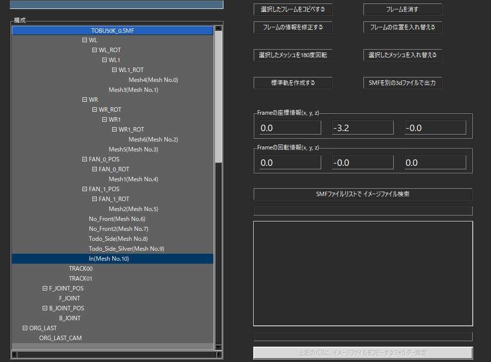

# 基本的なやり方

## 0. 用語説明

[フレームとメッシュについて](FRAME_MESH.md)

## 1. FBXを用意する

入れ替えるFBXファイルを用意する

## 2. 旧作で読込ませるファイルを用意する

ここでは、「TOBU50K_0.SMF」で説明する。

まず、書き換えたいメッシュが具体的にどれなのか把握しておく。

ここでは、Unityで把握する方法を記載しておく。

SMFを別の3dファイルで出力し（FBXで良い）、Unityで読込ませて

外側のモデルがどれなのか確認する。

右側に「Mesh Renderer」が表示され

チェックを外すと見えなくなる。

このメッシュを指定しているフレームが「In」

つまり、「TOBU50K_0.SMF」の10番のメッシュが、入れ替える対象となる。

ここでは、Inを除いた全てのメッシュフレームは不要であるため消しておく。

必ず消す必要はないため、必要に応じて対応する。

## 3. 読込んだファイルがSMFの場合

例えば、LSの新幹線のモデル「S300_00.SMF」を読込むと

SMFで取得したメッシュ情報リストが出る。

適宜なものを選択して置き換える。

## 4. 読込んだファイルがFBXの場合

例えば、SSの東急8500系のモデル「TQ8500Mdl00.fbx」を読込むと

FBXで取得したメッシュ情報リストが出る。

同じく適宜なものを選択して置き換えれば良いが

「メッシュフレーム名」のみのリストであるため、重複している要素がある。

注意すること。

## 5. MDLINFOでSMFを読込ませる

SMFの編集が終わったら、次はMDLINFOの対応。

「SMF情報でモデル追加」ボタンを押下して

対応したSMFファイルを読込ませる

読込ませると、一番下に追加される。

MDLINFOでこのモデルと連動させるモデルバイナリを

適宜なもので作成しておく

必要に応じて、SMFの詳細要素（メッシュ関連）を修正しておく

## 6. モデルバイナリのファイルを用意する

モデルバイナリで特に何か動作させることがなければ

（ワイパーを動かす、最後尾のモデルを180度回転するなど）

「HX200_1.bin」をコピペするだけで良い。

モデルバイナリについては、[【こちら】](/program/mdlBin/README.md)のリンクを参照

## 7. 車両性能で、モデルを読込ませる

車両性能の編成情報で、読込ませるモデルを置き換える

## 8. ゲームで確認する

新幹線のモデルを読込ませたもの

SSの東急8500系を読込ませたもの

発光している理由は、MDLINFOで読込ませた

「DIFF」や「EMIS」の要素が原因。

適宜に修正すると、このようになる。（一部分のみ修正）

## 9. メッシュを追加したい場合

まず、適当なフレームを選択してコピペする

ここでは、「In」フレームをコピペする

「フレーム情報を修正する」ボタンで

meshNoのところに適当な数字を入れる

現在メッシュの数より大きい数字を入れると、自動的に最後のメッシュ番号を追加する

ただし、このように追加されたメッシュは「空のメッシュ」であるため、

必ず情報があるメッシュで入れ替えること。

## 10. メッシュのみ削除したい場合

meshNoのところに-1を入れる

これにより、メッシュのみ削除することが出来る。

残りのメッシュ番号は、ズレるところのみ再調整される。

   

## パンタグラフのモデルは？

パンタグラフは、モデルバイナリが必要ないので

5番と6番の工程を省略しても良い

ただし、このままだとこの位置に

パンタグラフの「花火（アーク）」の位置がズレてしまうので

適宜に調整すること