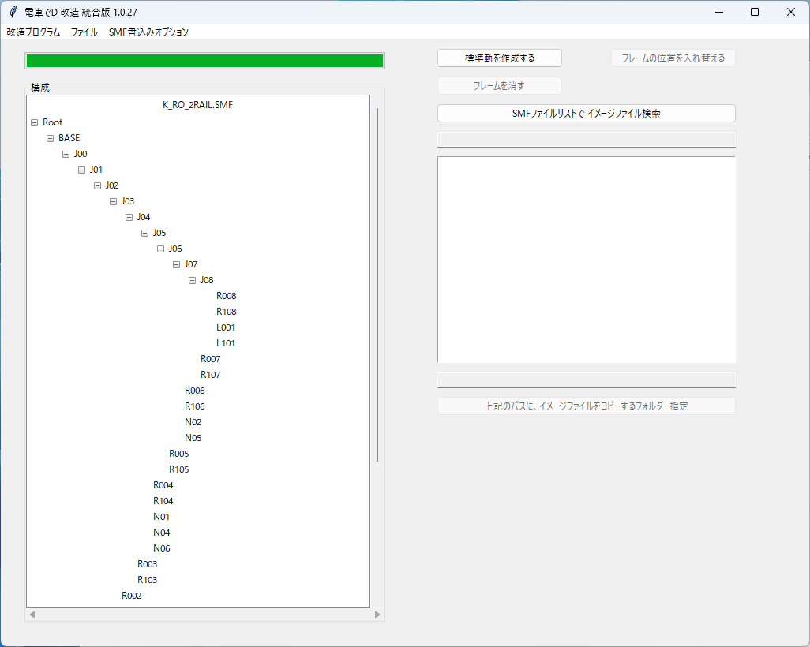

# SMF

## 実行方法

メニュの「ファイルの開く」で指定のSMFファイルを開く。

必ず、プログラムが書込みできる場所で行ってください

今は、SMFの階層を見たり、

詳しい情報をテキストファイルで書込んだり、

下記の機能しか出来ない。

### 標準軌を作成する

CS専用の標準軌モデルとRSの狭軌モデルを使って

RS専用の標準軌を作成する。

### フレームの位置を入れ替える

フレームを指定要素の子要素に移す。

指定した要素の全ての子要素にも影響が及ぶので注意すること。

### フレームを消す

フレームを消す。

指定した要素の全ての子要素にも影響が及ぶので注意すること。

### SMFをx3dで抽出する

x3dファイルで抽出できる。

ただし、抽出されたモデルは読込むソフトによって一部要素が表示されなかったりする

（Blenderの場合、空のtransform要素）

### Frameの座標情報（x, y, z）

指定したFrameの、座標情報（position）を表示する

### Frameの回転情報（x, y, z, w）

指定したFrameの、回転情報（Quaternion）を表示する

### SMFファイルリストで イメージファイル検索

指定した複数のSMFファイルを分析して、

SMFで使われるテクスチャーが、SMFがあるフォルダーに

存在するかチェックする。

### 上記のパスに、イメージファイルをコピーするフォルダー指定

SMFファイルリストで分析した結果、

フォルダーに存在しないテクスチャーがある場合、

テクスチャーがあるフォルダーを指定して、コピーすることが出来る。

### FAQ

* Q. 電車でDのゲームがあるが、指定したSMFファイルがない。  

  * A. PackファイルをGARbro のような、アーカイバで展開すると得られる。

  * A. GARbro を使用して空パスワードで解凍すると無効なファイルになるので、適切なパスワードを入力すること。

* Q. SMFファイルを指定しても、「電車でDのSMFではない、またはファイルが壊れた可能性があります。」と言われる

  * A. 抽出方法が間違っているか、抽出時のパスワードが間違っているのでは？作業工程をやり直した方がよい。

* Q. SMFファイルを改造しても、変化がないけど？

  * A. 既存のPackファイルとフォルダーが同時にあるなら、Packファイルを優先して読み込んでいる可能性がある。

    読み込みしないように、抽出したPackファイルを変更するか消そう。

* Q. ダウンロードがブロックされる、実行がブロックされる、セキュリティソフトに削除される

  * A. ソフトウェア署名などを行っていないので、ブラウザによってはダウンロードがブロックされる

  * A. 同様の理由でセキュリティソフトが実行を拒否することもある。

以上。