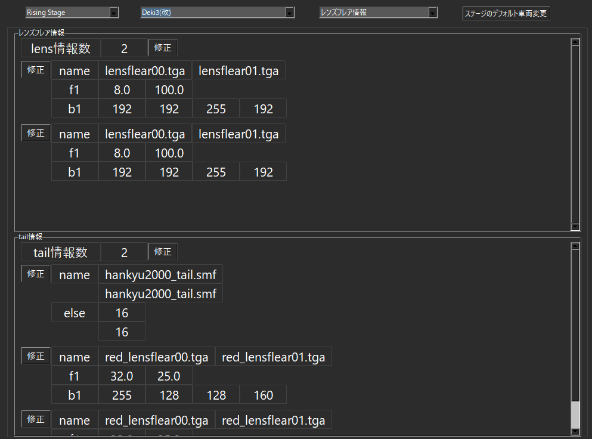

# ライト系の調整

ここでは、車両のレンズフレア、テールライトの

位置を調整する方法を記載する。

もし、車両を選択する際にゲームが落ちてしまう現象があるとすれば、

ここの調整でミスしているかもしれない。

## レンズフレア、テールライト

SMFのBODYにあるフレームの中、

「L00～」で始まるフレームが、前照灯などで使われるレンズフレアの位置

「TAIL00～」で始まるフレームが、テールライトの位置である

ここのフレームの位置を調整すると

レンズフレア、テールライトの光る位置を調整できる。

## 車両性能のレンズフレア、テールライト

車両性能で定義された

レンズフレア情報とテールライト情報によって、

光の大きさ（f1と思われる）と、

光の色（b1と思われる）などを調整できる。

故になるべく、SMFのフレームの個数と、車内性能で定義された情報の個数は

一致させる必要がある。

   

### もし、先頭車と最後尾車のモデルが異なる場合、テールライトの位置は？

推測だけど、この場合

まず、最後尾車のモデルで定義された「L00～」の位置で光る。

L00がない、あるいは足りない場合は「TAIL00～」の位置で光る。

### もし、最後尾車のSMFモデルで、「L00～」、「TAIL00～」もない場合、テールライトの位置は？

読込んだSMFのフレームの中、内部で読み込んだ位置で光ると思うが

どうやって選定しているかは不明。