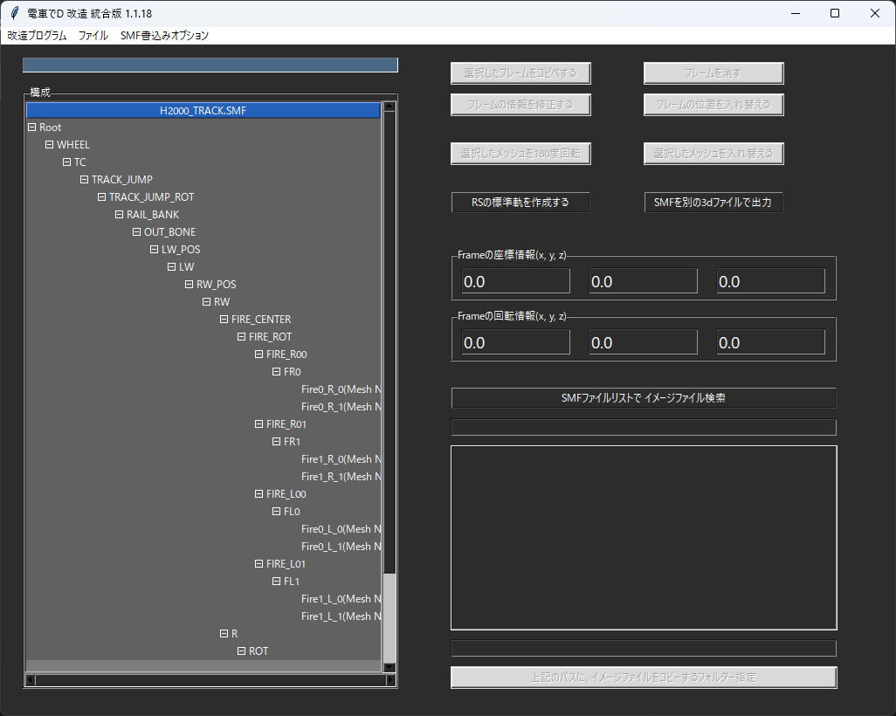
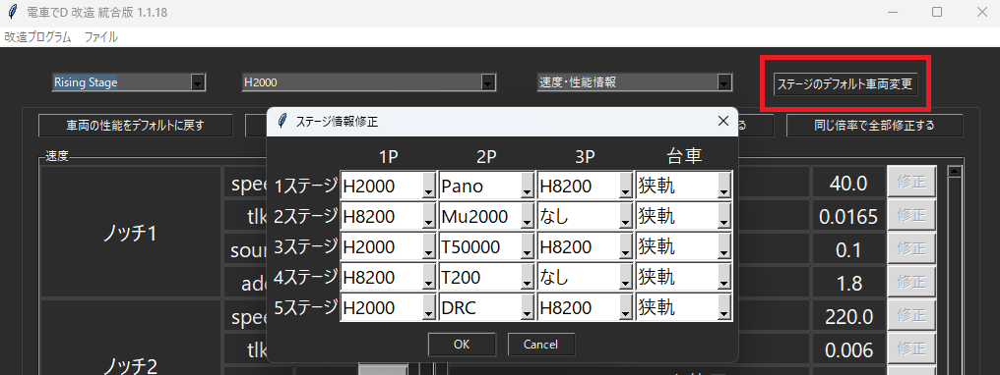

# RSで標準軌のモデルで走る方法

## 標準軌モデルを作成する

まず、CSの標準軌を読み込ませる。

このモデルのメッシュを元に、標準軌を作成する。

対応できるモデルは、下記の通り

| CSのモデル | RSの狭軌 （追加で読み込ませるもの） | RSの標準軌 （自動作成されるもの） |
| --- | --- | --- |
| H2000_TRACK.SMF | H2000_Track_LowD4.SMF | H2000_Track_D4.SMF |
| K8000_TRACK.SMF | K8000_Track_LowD4.SMF | K8000_Track_D4.SMF |
| JR2000_TRACK_LOW2.SMF | JR2000_Track_LowD4.SMF | JR2000_Track_D4.SMF |
| K2100_TRACK.SMF | KQ2100_Track_LowD4.SMF | KQ2100_Track_D4.SMF |
| UV_TRACK.SMF | UV_Track_LowD4.SMF | UV_Track_D4.SMF |
| K800_TRACK.SMF | K800_Track_LowD4.SMF | K800_Track_D4.SMF |
| - | MUTRACK_LOW.SMF | Mu_Track_D4.SMF |

※ミュースカイの台車のみ、標準軌がないため

ミュースカイの狭軌、「MUTRACK_LOW.SMF」を読み込ませた情報で

横に伸ばす方法で対応。

「RSの標準軌を作成する」ボタンで

指示通りに読込ませると、RS専用の標準軌を作成できる。

## ステージに標準軌を適用する

車両性能で、「TRAIN_DATA4TH.BIN」を読み込ませる。

そこで、「ステージのデフォルト車両変更」で

適用する台車を変更できる。

