# 台車の位置、号車同士の距離調整

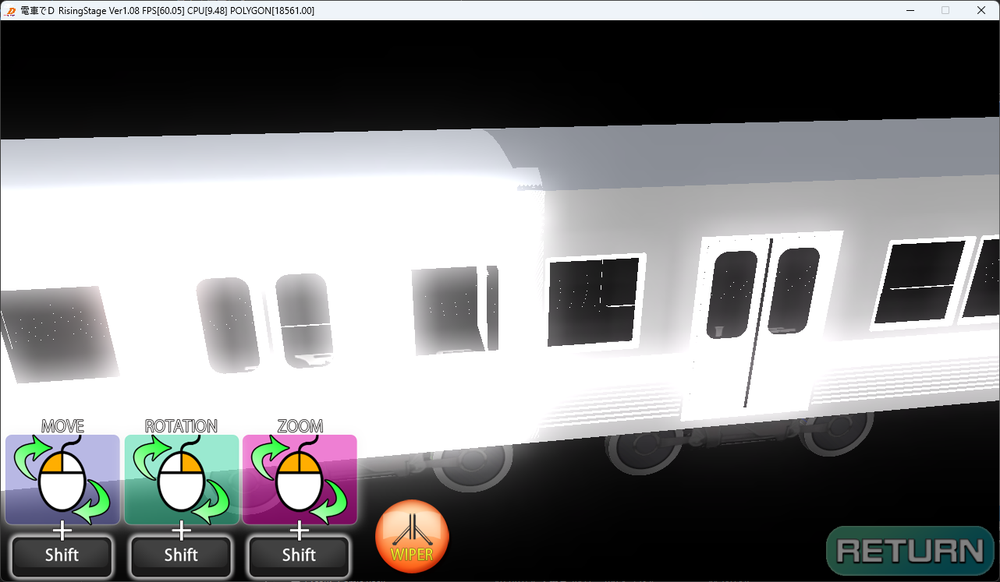

モデル編成時、このようにモデルの長さによって

号車同士が重なることがある場合

SMFの「F_JOINT」と「B_JOINT」の位置を変更する必要がある

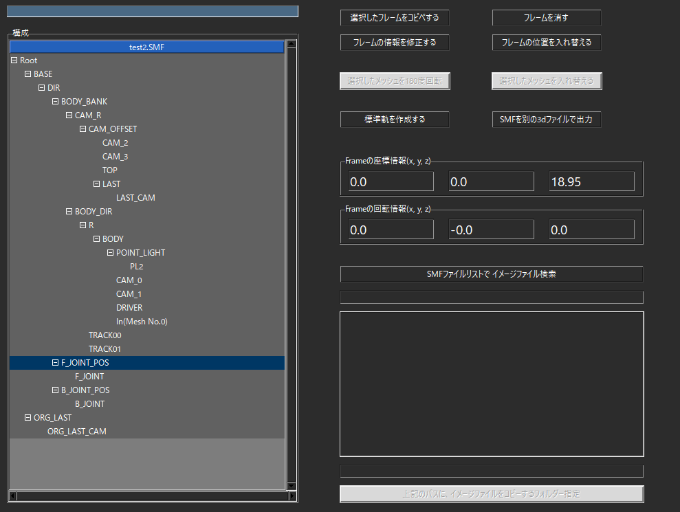

また、モデルによって「F_JOINT_POS」と「B_JOINT_POS」が

定義されていることがあるので、必要に応じて調整する。

「Z座標」のみ調整するだけで良い

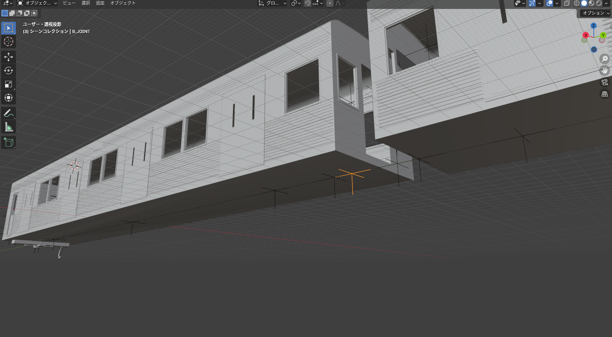

今の設定だと、先頭車の「B_JOINT」の位置がここ

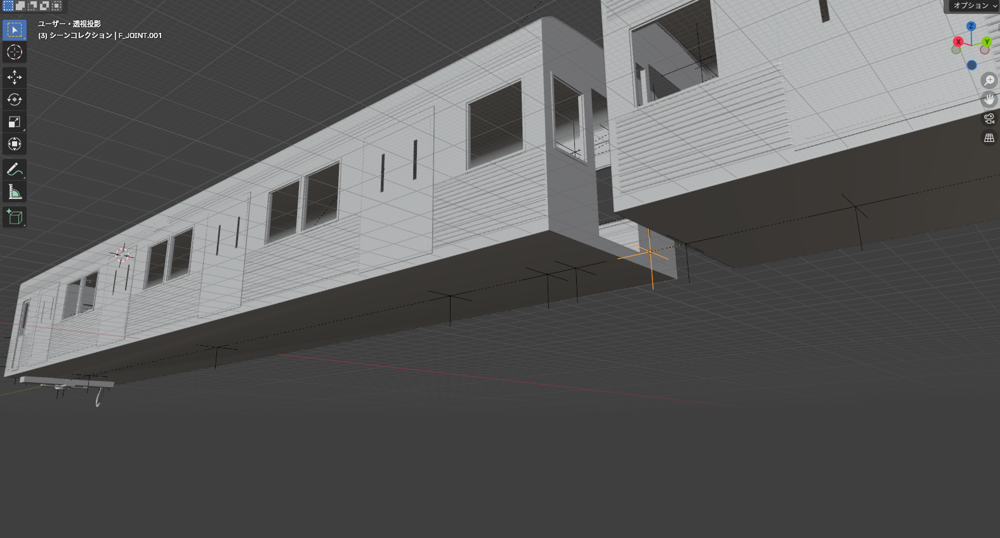

2号車の「F_JOINT」の位置がここであるため

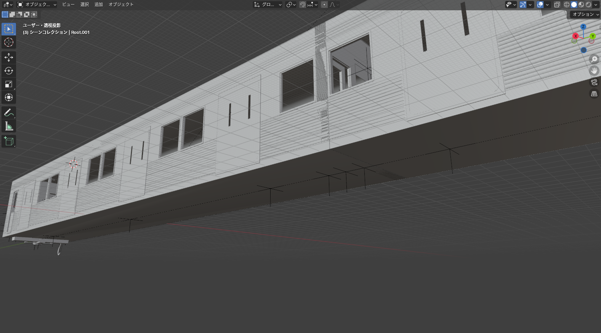

編成時「B_JOINT」と「F_JOINT」の位置を合わせるように配置するので

このように重なる部分が出来てしまう

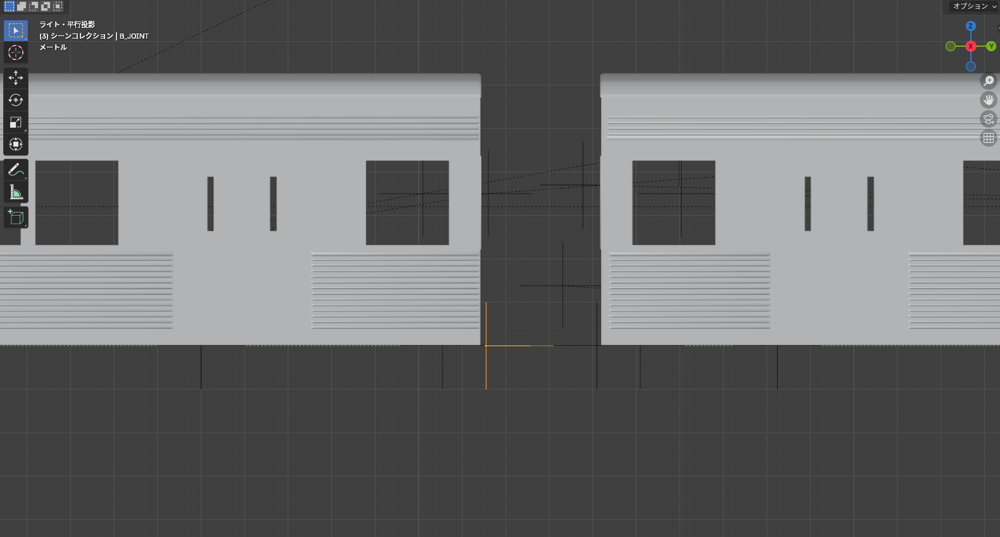

故に、「B_JOINT」の位置がここになるように調整し

（B_JOINT_POSを-20.55に変更）

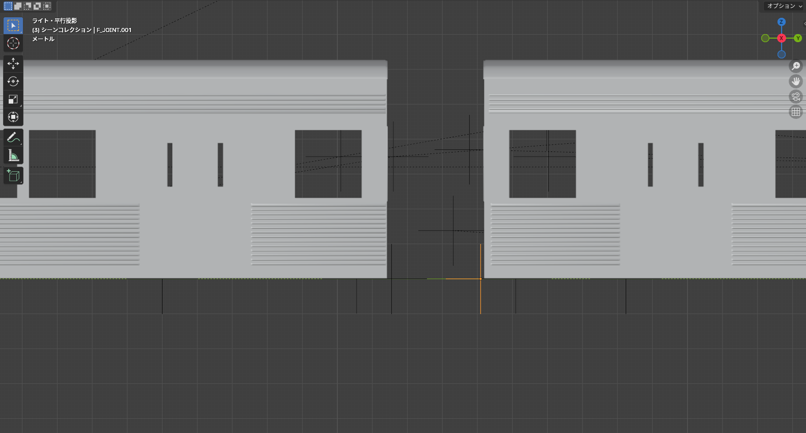

「F_JOINT」の位置がここになるように調整すると

（F_JOINT_POSを18.15に変更）

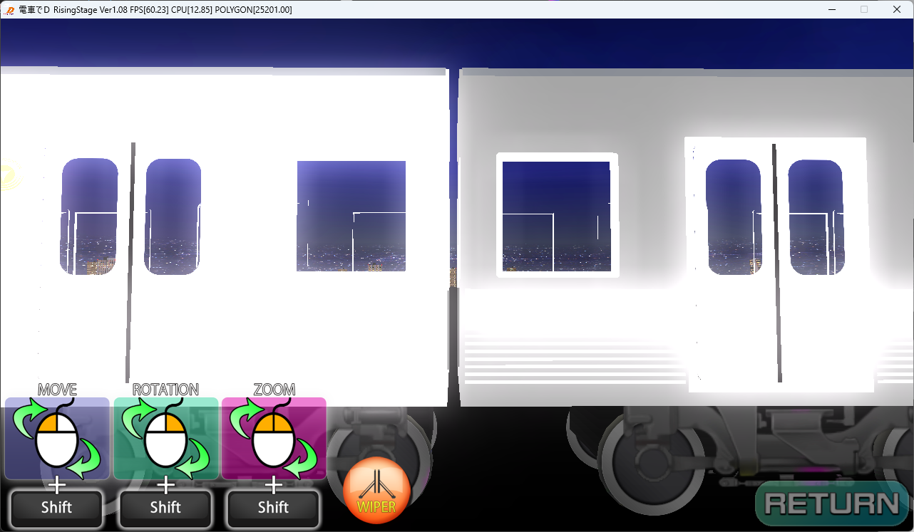

このように配置される。

適宜な値で調整すること。

   

## 台車の位置

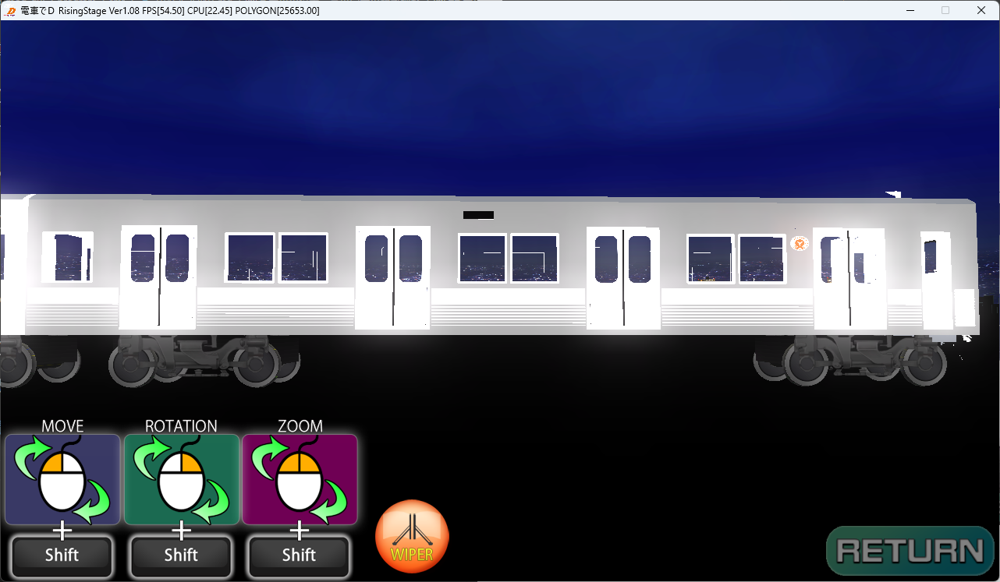

台車の位置を調整するには

モデルの「TRACK00」と「TRACK01」の位置を調整する

※今のTRACK00のZの値は「15.0」、TRACK01のZの値は「-15.0」

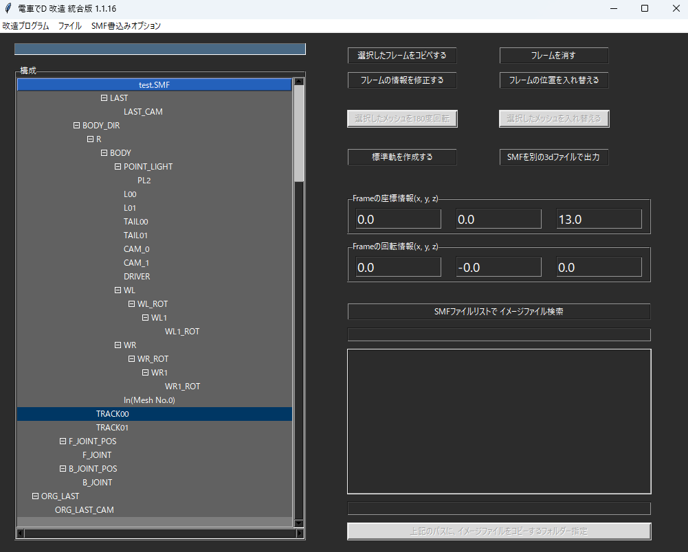

もし、TRACK00の値を「13.0」、TRACK01のZの値を「-17.0」にすると

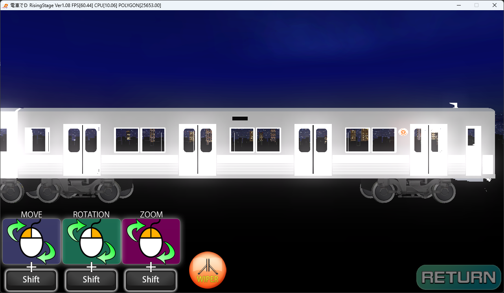

このように調整される。

同じく、適宜な値で調整すること。