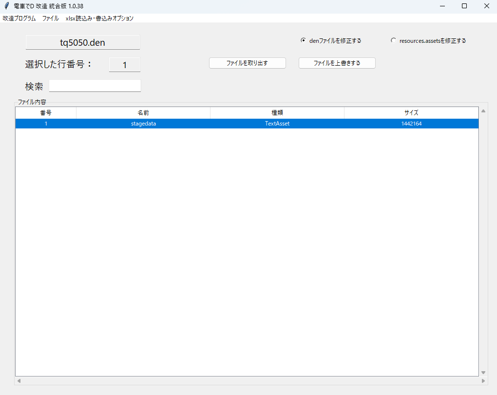
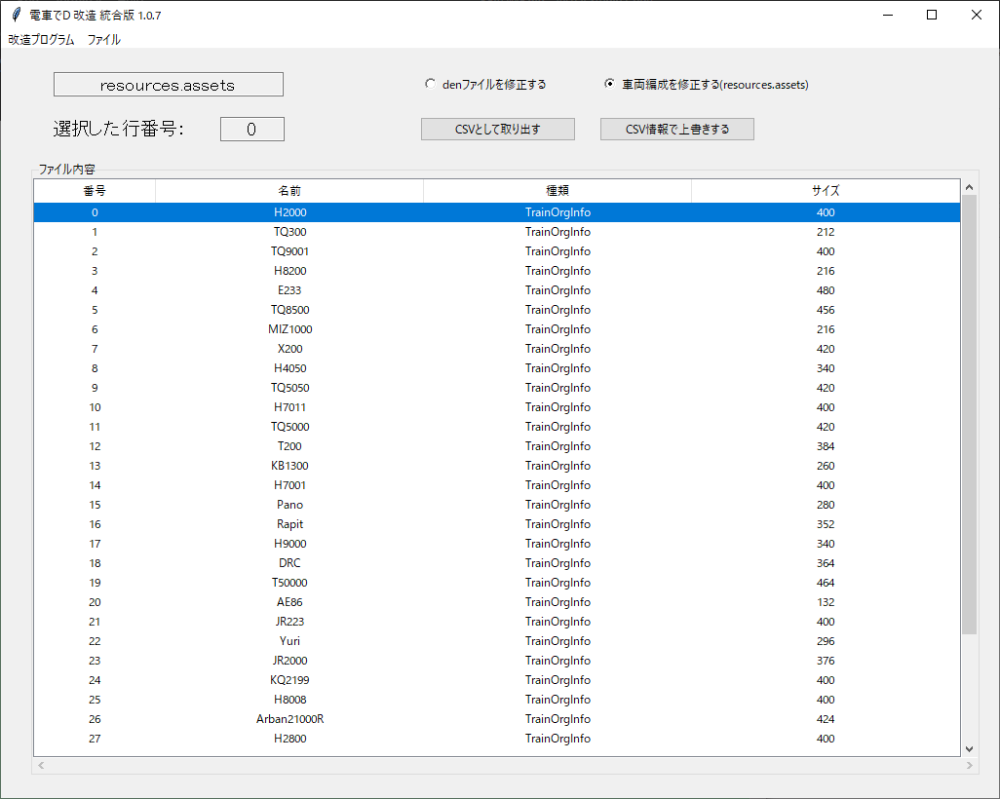
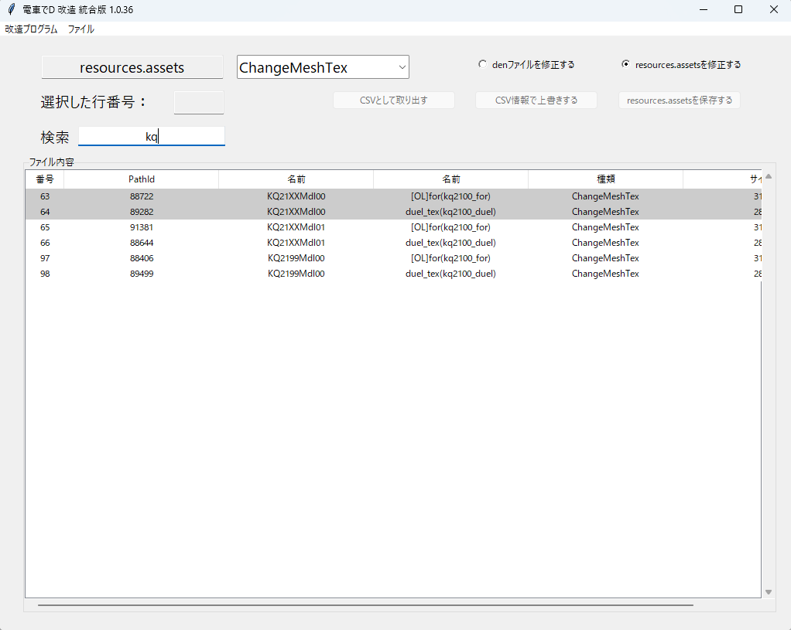

# SS改造

## 実行方法

メニュの「ファイルの開く」で指定のファイルを開く。

必ず、プログラムが書込みできる場所で行ってください

### denファイルを修正する

「ファイルを取り出す」ボタンで、指定ファイルを取り出すことが出来る。

「ファイルを上書きする」ボタンで、指定ファイルを読み込ませると上書きできる。

ファイルがstagedataの場合、エクセルで取り出し、上書きすることもできる。

ただし、現状、依存しているライブラリUnityPyでは

TextAssetしか上書きができない。

また、追加・削除することも出来ないので

そうしたい場合、Unityプログラムで作成する必要がある。

### resoureces.assetsを修正する

resoureces.assetsにある、TrainOrgInfoとChangeMeshTexを修正できる。

- TrainOrgInfo

  車両やパンタのモデル、それぞれの編成方法を定義している

- ChangeMeshTex

  車両の幕を、どのテクスチャで表示するかリストで定義している

それぞれの要素をCSVとして取り出したり、上書きする。

「resources.assetsを保存する」ボタンで

今まで上書きして変更した分をまとめて【resources_new.assets】を新規に作成する。

### FAQ

* Q. ファイルを改造しても、変化がないけど？

  * A. denファイルの場合、InGameDataの中で、一番バージョンが高いフォルダーに入っているファイルを優先して読み込むため、

    修正したファイルを最新フォルダーに置いておく。

* Q. ダウンロードがブロックされる、実行がブロックされる、セキュリティソフトに削除される

  * A. ソフトウェア署名などを行っていないので、ブラウザによってはダウンロードがブロックされる

  * A. 同様の理由でセキュリティソフトが実行を拒否することもある。

* Q. エクセルでファイルを取り出す、または上書きするとき、エラーになるが？

  * A. 取り出すときは、txtで上書きしたデータの整合性が合わない、

    上書きするときは、エクセルのデータの整合性が合わないと思われる。

    取り出すときにエラーになった場合は、ちゃんとしたデータをtxtで上書きしてから試してみよう。

以上。